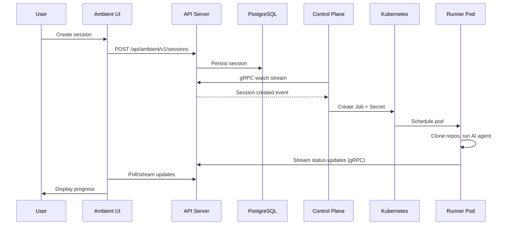

The platform is built on a PostgreSQL-backed REST API with a Kubernetes control plane that reconciles sessions into Jobs. The API server (`ambient-api-server`) is the source of truth; the control plane watches it via gRPC streams and creates Kubernetes resources as needed.

## Session flow

Every session follows this path through the system:

```
User creates session → API Server persists to DB → Control Plane receives gRPC event →
Control Plane spawns Job → Pod runs AI agent → Results sync back to API Server → UI displays progress
```



---

## Components

**API Server** (`ambient-api-server`) -- Go REST + gRPC microservice built on rh-trex-ai, backed by PostgreSQL. Source of truth for sessions, projects, and settings. Exposes both REST endpoints for the UI/CLI and gRPC watch streams for the control plane.

**Control Plane** (`ambient-control-plane`) -- Go service that watches the API server via gRPC streams and reconciles sessions into Kubernetes Jobs. Handles namespace provisioning, credential injection, and pod lifecycle. Not a CRD-based operator — it does not use controller-runtime or watch Custom Resources.

**Runner** (`ambient-runner`) -- Polymorphic AG-UI server that runs inside each Job pod. Supports multiple AI provider bridges (Claude Agent SDK, Gemini CLI, LangGraph), streams output back to the API server, and handles graceful shutdown on timeout or cancellation.

**UI** (`ambient-ui`) -- NextJS application with Shadcn UI components. Provides session creation, real-time chat interface, and workspace management. Uses React Query for server state.

**MCP Server** (`ambient-mcp`) -- MCP tool definitions exposing platform capabilities to AI agents, available in sidecar and public endpoint modes.

**SDK** (`ambient-sdk`) -- Go, Python, and TypeScript client libraries generated from the OpenAPI spec.

**CLI** (`acpctl`) -- Command-line tool for managing sessions, built on the Go SDK.

---

## Runner types

Runner types are configurable execution environments that determine which AI framework processes a session. Each runner type maps to a **bridge** -- a Python class that implements the `PlatformBridge` interface and adapts a specific AI framework to the platform's AG-UI event protocol.

### Available bridges

The runner resolves which bridge to load from the `RUNNER_TYPE` environment variable, defaulting to `claude-agent-sdk`:

| Bridge | Framework | Provider | Filesystem | MCP | Tracing | Session persistence |
|--------|-----------|----------|------------|-----|---------|---------------------|
| Claude Agent SDK | `claude-agent-sdk` | `anthropic` | Yes | Yes | Langfuse | Yes |
| Gemini CLI | `gemini-cli` | `google` | Yes | Yes | Langfuse | No |
| LangGraph | `langgraph` | configurable | No | No | LangSmith | No |

Each bridge declares its capabilities through a `FrameworkCapabilities` object. The UI reads these capabilities from the `/capabilities` endpoint and hides UI panels that do not apply -- for example, the file browser is hidden for LangGraph sessions because that bridge sets `file_system=False`. A `ReplayBridge` also exists for testing and development but is not used in production.

### Model-to-runner mapping

The model registry (`models.json`) assigns a `provider` field to each model. When a user selects a model, the platform uses the provider to determine which runner type handles the session:

- **`anthropic`** models (Claude Sonnet, Opus, Haiku) route to the `claude-agent-sdk` runner.
- **`google`** models (Gemini Flash, Pro) route to the `gemini-cli` runner.

Some models are feature-gated and only appear when the corresponding feature flag is enabled.

### Capability differences

Bridges expose different subsets of agent features depending on framework support:

- **`agentic_chat`** -- Interactive multi-turn conversation (all bridges).
- **`human_in_the_loop`** -- Pause execution to collect user input (Claude, LangGraph).
- **`thinking`** -- Extended thinking / chain-of-thought display (Claude only).
- **`shared_state`** -- Share state between turns within a session (Claude, LangGraph).
- **`backend_tool_rendering`** -- Render tool calls and results server-side (Claude, Gemini).

### Runner type registry

Runner types are defined in the **agent registry**, a JSON file mounted from a ConfigMap at `/config/registry/agent-registry.json`. Each entry is an `AgentRuntimeSpec` that specifies the container image, port, environment variables, sandbox configuration, authentication requirements, and an optional feature gate.

The API server loads and caches the registry in memory (60-second TTL) and exposes it through `GET /api/ambient/v1/runner-types`. Entries with a `featureGate` are filtered out unless the corresponding flag is enabled, with support for workspace-scoped overrides. This design allows operators to add new runner types or gate experimental frameworks without redeploying.

---

## Key architectural decisions

The project maintains [Architectural Decision Records](https://github.com/ambient-code/platform/tree/main/docs/internal/adr) for the full rationale behind each choice. The major decisions:

- **Kubernetes-native execution** ([ADR-0001](https://github.com/ambient-code/platform/blob/main/docs/internal/adr/0001-kubernetes-native-architecture.md)) -- Sessions execute as Kubernetes Jobs. Kubernetes provides RBAC, namespaces, and resource quotas for multi-tenancy. (Note: the original ADR described CRDs as the data model; v2 moved the source of truth to PostgreSQL per ADR-0009.)

- **REST API + PostgreSQL** ([ADR-0009](https://github.com/ambient-code/platform/blob/main/docs/internal/adr/0009-rest-api-postgresql-trex-foundation.md)) -- The API server uses rh-trex-ai with PostgreSQL instead of storing data in Kubernetes CRDs. This enables proper querying, indexing, and relational data access.

- **User token authentication** ([ADR-0002](https://github.com/ambient-code/platform/blob/main/docs/internal/adr/0002-user-token-authentication.md)) -- Every API operation runs with the calling user's token. Kubernetes RBAC is the single source of authorization.

- **Go for API/control plane, Python for runner** ([ADR-0004](https://github.com/ambient-code/platform/blob/main/docs/internal/adr/0004-go-backend-python-runner.md)) -- Go for the API layer and Kubernetes integration. Python for the runner because the Claude Code SDK and tool orchestration benefit from Python's flexibility.

- **NextJS with Shadcn UI** ([ADR-0005](https://github.com/ambient-code/platform/blob/main/docs/internal/adr/0005-nextjs-shadcn-react-query.md)) -- Server-side rendering for initial page loads, client-side interactivity for the chat interface, and a consistent component library.

---

## Further reading

- [Design documents](https://github.com/ambient-code/platform/tree/main/docs/internal/design) -- Session reconciliation, runner contract, status redesign
- [Architecture diagrams](https://github.com/ambient-code/platform/tree/main/docs/internal/architecture/diagrams) -- Mermaid diagrams for system overview, session lifecycle, deployment stack
