# Platform Specification

Consolidated platform spec covering the data model, API, session lifecycle, control plane, runner, and MCP server.

---

## Data Model

**Date:** 2026-03-20
**Status:** Active
**Last Updated:** 2026-06-03 — added Application (GitOps continuous sync for agent fleets); addressed review feedback: credential_id FK for remote auth, RoleBinding escalation rules, prune safety, health status semantics, gitops role grantability, sync engine kind filtering
**Previous:** 2026-05-12 — migrate Credentials from project-scoped to global routes (`/credentials`); remove `project_id` from model, OpenAPI, and SDK; add drop-column migration; update coverage matrix
**Workflow:** *(merged into skills/build/full-stack-pipeline)* — implementation waves, gap table, build commands, run log
**Design:** `credentials-session.md` — full Credential Kind design spec and rationale

---

### Overview

The Ambient API server provides a coordination layer for orchestrating fleets of persistent agents across projects. The model is intentionally simple:

- **Project** — a workspace. Groups agents and provides shared context (`prompt`) injected into every agent start.
- **Agent** — a project-scoped, mutable definition. Agents belong to exactly one Project. `prompt` defines who the agent is and is directly editable (subject to RBAC).
- **Session** — an ephemeral Kubernetes execution run, created exclusively via agent start. Only one active Session per Agent at a time.
- **Message** — a single AG-UI event in the LLM conversation. Append-only; the canonical record of what happened in a session.
- **Inbox** — a persistent message queue on an Agent. Messages survive across sessions and are drained into the start context at the next run.
- **Credential** — a global secret. Stores a Personal Access Token or equivalent for an external provider (GitHub, GitLab, Jira, Google, Vertex AI, Kubeconfig). Consumed by runners at session start. Bound to Projects via RoleBindings — a single Credential can be shared across multiple Projects without duplication.
- **RoleBinding** — binds a Role to a subject (user or project) at a given scope. Ownership and access for all Kinds is expressed through RoleBindings. The subject and scope are each represented as typed nullable FKs — exactly one FK is non-null, determined by `scope`.
- **Application** — a GitOps binding that continuously syncs agent fleet definitions from a git repository to an Ambient instance. The Ambient equivalent of an Argo CD Application.

The stable address of an agent is `{project_name}/{agent_name}`. It holds the inbox and links to the active session.

---

### Entity Relationship Diagram

```mermaid
%%{init: {'theme': 'default', 'themeVariables': {'attributeColor': '#111111', 'lineColor': '#ffffff', 'edgeLabelBackground': '#333333', 'fontFamily': 'monospace'}}}%%
erDiagram

    User {
        string ID PK
        string username
        string name
        string email
        jsonb  labels
        jsonb  annotations
        time   created_at
        time   updated_at
        time   deleted_at
    }

    Project {
        string ID PK "name-as-ID"
        string name
        string description
        string prompt "workspace-level context injected into every agent start"
        jsonb  labels
        jsonb  annotations
        string status
        time   created_at
        time   updated_at
        time   deleted_at
    }

    ProjectSettings {
        string ID PK
        string project_id FK
        string group_access
        string repositories
        time   created_at
        time   updated_at
        time   deleted_at
    }

    %% ── Agent (project-scoped, mutable) ──────────────────────────────────────

    Agent {
        string ID PK "KSUID"
        string project_id FK
        string parent_agent_id FK "nullable — parent agent for sub-agents"
        string owner_user_id FK "user who owns this agent"
        string name "human-readable; unique within project"
        string display_name "nullable — human-friendly display label"
        string description "nullable — purpose description"
        string prompt "who this agent is — mutable; access controlled via RBAC"
        string repo_url "nullable — primary repository for agent sessions"
        string workflow_id "nullable — default workflow for agent sessions"
        string llm_model "active LLM; default claude-sonnet-4-6"
        float  llm_temperature "default 0.7"
        int32  llm_max_tokens "default 4000"
        string bot_account_name "nullable — service account for git ops"
        string resource_overrides "nullable — JSON pod resource overrides"
        string environment_variables "nullable — JSON extra env vars"
        string current_session_id FK "nullable — denormalized for fast reads"
        jsonb  labels
        jsonb  annotations
        time   created_at
        time   updated_at
        time   deleted_at
    }

    %% ── Inbox (queue on Agent — messages waiting for next session) ────────────

    Inbox {
        string ID PK
        string agent_id FK "recipient — project/agent address"
        string from_agent_id FK "nullable — sender; null = human"
        string from_name "denormalized sender display name"
        text   body
        bool   read "false = unread; drained at session start"
        time   created_at
        time   updated_at
        time   deleted_at
    }

    %% ── Session (ephemeral run — created by user or via agent start) ─────────

    Session {
        string  ID PK
        string  name "human-readable display name"
        string  project_id FK "nullable — direct project context (no agent)"
        string  agent_id FK "nullable — set when started via agent ignite"
        string  created_by_user_id FK "who created or started the session"
        string  assigned_user_id FK "nullable — override for session ownership"
        string  parent_session_id FK "nullable — source session for clones"
        string  prompt "task scope for this run"
        string  repo_url "nullable — primary repo for the session"
        string  repos "JSON array of RepoEntry (additional attached repos)"
        string  workflow_id "nullable — JSON-encoded workflow config"
        string  llm_model "active LLM; default claude-sonnet-4-6"
        float   llm_temperature "default 0.7"
        int32   llm_max_tokens "default 4000"
        int32   timeout "nullable — max session duration in seconds"
        string  bot_account_name "nullable — service account for git ops"
        string  resource_overrides "nullable — JSON pod resource overrides"
        string  environment_variables "nullable — JSON extra env vars"
        string  labels "JSON map; queryable tags"
        string  annotations "JSON map; freeform metadata"
        string  phase
        time    start_time
        time    completion_time
        string  kube_cr_name "Kubernetes CR / pod name (set to session ID on create)"
        string  kube_cr_uid
        string  kube_namespace
        string  sdk_session_id
        int32   sdk_restart_count
        string  conditions
        string  reconciled_repos
        string  reconciled_workflow
        time    created_at
        time    updated_at
        time    deleted_at
    }

    %% ── SessionMessage (AG-UI event stream — real LLM turns) ─────────────────

    SessionMessage {
        string ID PK
        string session_id FK
        int    seq "monotonic within session"
        string event_type "user | assistant | tool_use | tool_result | system | error"
        string payload "message body or JSON-encoded event"
        time   created_at
    }

    %% ── RBAC ─────────────────────────────────────────────────────────────────

    Role {
        string ID PK
        string name
        string display_name
        string description
        jsonb  permissions
        bool   built_in
        time   created_at
        time   updated_at
        time   deleted_at
    }

    RoleBinding {
        string ID PK
        string role_id FK
        string scope         "global | project | agent | session | credential"
        string user_id FK    "nullable — set when scope identifies a user subject"
        string project_id FK "nullable — set when scope=project"
        string agent_id FK   "nullable — set when scope=agent"
        string session_id FK "nullable — set when scope=session"
        string credential_id FK "nullable — set when scope=credential"
        time   created_at
        time   updated_at
        time   deleted_at
    }

    %% ── Credential (global PAT/token store, bound via RoleBindings) ──────────

    Credential {
        string ID PK "KSUID"
        string name "human-readable; globally unique"
        string description
        string provider "github | gitlab | jira | google | vertex | kubeconfig"
        string token "write-only; stored encrypted"
        string url "nullable; service instance URL"
        string email "nullable; required for Jira"
        jsonb  labels
        jsonb  annotations
        time   created_at
        time   updated_at
        time   deleted_at
    }

    %% ── ScheduledSession (project-scoped recurring agent trigger) ──────────

    ScheduledSession {
        string ID PK "KSUID"
        string project_id FK
        string agent_id FK "nullable — which Agent to ignite on each trigger"
        string name "human-readable; unique within project"
        string description
        string schedule "cron expression"
        string timezone "IANA timezone; default UTC"
        bool   enabled "false = suspended; schedule not evaluated"
        string session_prompt "injected as Session.prompt on each trigger"
        int32  timeout "nullable — max session duration in seconds for triggered sessions"
        int32  inactivity_timeout "nullable — idle timeout in seconds"
        bool   stop_on_run_finished "nullable — stop session when run completes"
        string runner_type "nullable — override runner type for triggered sessions"
        time   last_run_at "nullable; wall-clock time of last trigger"
        time   next_run_at "nullable; computed from schedule + timezone"
        time   created_at
        time   updated_at
        time   deleted_at
    }

    %% ── Application (GitOps sync — Argo CD for Ambient) ──────────────

    Application {
        string ID PK "KSUID"
        string name "unique; human-readable"
        string source_repo_url "git repository URL"
        string source_target_revision "branch, tag, or commit SHA"
        string source_path "path within repo to kustomize overlay"
        string destination_ambient_url "nullable — target Ambient API URL; null = local"
        string destination_project "target project name; created if CreateProject=true"
        string credential_id FK "nullable — Credential for remote Ambient auth; required when destination_ambient_url is set"
        bool   auto_sync "enable automated sync on git change"
        bool   auto_prune "delete resources removed from git"
        bool   self_heal "re-sync when live state drifts"
        string sync_options "comma-separated: CreateProject=true, etc."
        int    retry_limit "max sync retries on failure"
        string sync_status "Synced | OutOfSync | Unknown"
        string health_status "Healthy | Degraded | Progressing | Unknown"
        string sync_revision "last successfully synced git commit SHA"
        string operation_phase "Succeeded | Failed | Running | idle"
        string operation_message "human-readable sync result summary"
        jsonb  resource_status "per-resource sync/health detail"
        jsonb  conditions "error conditions array"
        jsonb  labels
        jsonb  annotations
        time   last_synced_at "timestamp of last successful sync"
        time   created_at
        time   updated_at
        time   deleted_at
    }

    %% ── Relationships ────────────────────────────────────────────────────────

    Project         ||--o{ ProjectSettings  : "has"
    Project         ||--o{ Agent            : "owns"
    RoleBinding     }o--o| Credential       : "credential_id"
    Project         ||--o{ ScheduledSession : "owns"

    User            }o--o{ RoleBinding      : "user_id"
    Project         }o--o{ RoleBinding      : "project_id"

    RoleBinding     }o--o| Agent            : "agent_id"
    RoleBinding     }o--o| Session          : "session_id"

    Agent           ||--o{ Session          : "runs"
    Agent           ||--o| Session          : "current_session"
    Agent           ||--o{ Inbox            : "receives"
    Agent           ||--o{ ScheduledSession : "scheduled_by"

    Inbox           }o--o| Agent            : "sent_from"

    Application }o--o| Project        : "syncs_to"
    Application }o--o| Credential     : "credential_id"

    Session         ||--o{ SessionMessage   : "streams"

    Role            ||--o{ RoleBinding      : "granted_by"
```



---

### Application — GitOps Continuous Sync

Application is the Ambient equivalent of an [Argo CD Application](https://argo-cd.readthedocs.io/en/stable/core_concepts/). It binds a git repository source (containing kustomize-based agent fleet definitions) to a destination Ambient instance and project, then continuously reconciles the desired state from git against the live state in the platform.

#### Core Concepts (Argo CD Mapping)

| Argo CD Concept | Ambient Equivalent | Description |
|---|---|---|
| Application | **Application** | Declarative binding of source → destination |
| Source (repo + path + revision) | `source_repo_url` + `source_path` + `source_target_revision` | Git repo containing kustomize overlays of Projects, Agents, Credentials, RoleBindings |
| Application Source Type | Always **Kustomize** | The CLI's built-in kustomize engine renders the manifests |
| Destination (cluster + namespace) | `destination_ambient_url` + `destination_project` | Target Ambient instance + project name |
| Target State | Rendered kustomize output | The desired set of Projects, Agents, Credentials, RoleBindings, and Inbox seeds from git |
| Live State | Current API server state | What actually exists in the destination Ambient's project |
| Sync Status | `sync_status` | Whether live state matches target state: `Synced`, `OutOfSync`, `Unknown` |
| Sync Operation | `/sync` sub-resource | The act of applying target state to live state |
| Refresh | `/refresh` sub-resource | Fetch latest from git, render kustomize, diff against live state |
| Health | `health_status` | Are all synced agents healthy? `Healthy`, `Degraded`, `Progressing`, `Unknown` |
| Self-Heal | `self_heal` flag | Re-sync when live state drifts (agent modified via UI, deleted manually) |
| Prune | `auto_prune` flag | Delete agents/resources from Ambient that no longer exist in git |

#### What Gets Synced

An Application syncs **project-scoped fleet definitions** — a subset of resource kinds that `acpctl apply -k` handles (excluding infrastructure inventory kinds like Cluster and Ambient):

| Kind | Sync Behavior |
|---|---|
| `Project` | Created if `CreateProject=true` in `sync_options`; patched (description, prompt, labels, annotations) on subsequent syncs |
| `Agent` | Created or patched within the destination project; prompt, labels, annotations updated |
| `Credential` | Created if not present; idempotent by name |
| `RoleBinding` | Created if not present; idempotent by user+role+scope key. **Escalation-bound:** the sync engine can only create RoleBindings at or below the level of the service credential it uses (see Design Decisions). |
| `Inbox` (seed messages) | Idempotent delivery — only new messages (by `from_agent_id` + `body` content hash dedup) are posted. Uses immutable `from_agent_id` FK, not mutable `from_name`. |

#### What Does NOT Get Synced

| Kind | Why |
|---|---|
| `Session` | Ephemeral run artifact. Created via agent start, not via GitOps. |
| `SessionMessage` | Append-only event stream. |
| `ScheduledSession` | Project-scoped trigger config; future sync candidate. |
| `User` | Identity record. |
| `Role` | RBAC definition (platform-scoped, not project-scoped). |

#### Field Reference

| Field | Notes |
|---|---|
| `name` | Unique, human-readable. The stable address of this sync binding. |
| `source_repo_url` | Git repository URL. HTTPS or SSH. |
| `source_target_revision` | Branch name, tag, or commit SHA. Default: `main`. |
| `source_path` | Relative path within the repo to a kustomize directory (must contain `kustomization.yaml`). |
| `credential_id` | Nullable FK → Credential. The stored credential providing authentication for the destination Ambient's REST API. Required when `destination_ambient_url` is set. Uses the same write-only encrypted storage as all Credentials. The credential's token is resolved at sync time via `GET /credentials/{cred_id}/token` (gated by `credential:token-reader`). Null when targeting the local Ambient (controller uses its own service identity). |
| `destination_ambient_url` | Nullable. The Ambient API server URL to sync to. Null = local Ambient (this API server). When set, `credential_id` must also be set — async polling controllers have no request context to forward a token from. |
| `destination_project` | Target project name. The project is created on first sync if `CreateProject=true` is in `sync_options`. |
| `auto_sync` | If true, the controller polls the git repo and syncs automatically when changes are detected. If false, sync is manual via `POST /sync`. |
| `auto_prune` | If true, resources in the live state that are absent from the target state are deleted. If false, orphaned resources are left in place. **WARNING: Pruning a Project is permanently destructive.** All Agents, Sessions, Inbox messages, and SessionMessages in the project are cascade-deleted. The sync engine will never auto-prune a Project — Project removal requires manual confirmation via `POST /sync` with explicit `prune: true` and `prune_project: true` flags. Agent-level pruning operates normally under `auto_prune`. |
| `self_heal` | If true, the controller re-syncs when live state drifts from target state (e.g., an agent's prompt is changed via the UI). If false, drift is allowed. |
| `sync_options` | Comma-separated option flags. Initial options: `CreateProject=true`. |
| `retry_limit` | Max number of automatic retries on sync failure. Default: 3. |
| `sync_status` | Computed on refresh. `Synced` = live matches target. `OutOfSync` = differences detected. `Unknown` = not yet refreshed. |
| `health_status` | Computed from synced resources. `Healthy` = all synced resources exist in the destination and match the target state (name, prompt, labels, annotations match git). `Degraded` = one or more synced resources are missing, have field drift from target state, or failed to apply. `Progressing` = sync operation is currently running. `Unknown` = not yet assessed (never refreshed). Health is assessed per-resource and aggregated — any single `Degraded` resource makes the whole application `Degraded`. |
| `sync_revision` | The git commit SHA of the last successful sync. |
| `operation_phase` | State of the last sync operation: `Succeeded`, `Failed`, `Running`, or empty if never synced. |
| `operation_message` | Human-readable summary, e.g. `"3 created, 1 configured, 0 pruned"`. |
| `resource_status` | JSONB array of per-resource sync results: `[{"kind": "Agent", "name": "lead", "status": "Synced", "health": "Healthy", "message": "configured"}]`. |
| `conditions` | JSONB array of error conditions: `[{"type": "SyncError", "message": "...", "lastTransitionTime": "..."}]`. |
| `last_synced_at` | Timestamp of the last successful sync completion. |

#### Sync Lifecycle

```
1. Refresh: clone/fetch repo at source_target_revision
2. Render:  build kustomize at source_path → flat manifest stream
3. Diff:    compare rendered manifests against live state in destination project
4. Sync:    apply creates/patches/deletes to reconcile live → target
5. Status:  update sync_status, health_status, resource_status, operation_*
```

For automated sync (`auto_sync=true`), this lifecycle runs on a configurable polling interval (default: 3 minutes). For manual sync, it runs on `POST /api/ambient/v1/applications/{id}/sync`.

#### Destination Resolution

```
Application.destination_ambient_url set?
  |── null  ──> local Ambient (this API server's own service layer)
  |            ──> controller uses its own service identity
  |── set   ──> remote Ambient (SDK client pointed at the URL)
              ──> credential_id MUST be set (FK → Credential)
              ──> token resolved at sync time via GET /credentials/{id}/token
```

When targeting a remote Ambient, the sync engine acts as an API client to the remote Ambient's REST API, authenticated via the stored Credential. The credential is resolved at sync time — the controller never caches tokens beyond a single sync cycle. This is different from how Sessions use kubeconfig for direct K8s provisioning — the Application works entirely at the Ambient API layer.

#### Unsupported Kinds in Sync

The kustomize rendering engine (`acpctl apply -k`) supports additional resource kinds beyond what Application syncs (e.g., `Cluster`, `Ambient` — infrastructure inventory kinds). When a rendered kustomize tree contains documents of unsupported kinds, the sync engine **silently skips** them. Each skipped document is recorded in `resource_status` with a `Skipped` status:

```json
{"kind": "Ambient", "name": "staging-cluster", "status": "Skipped", "health": "Unknown", "message": "infrastructure inventory — not synced by Application"}
```

This is not an error. The sync operation proceeds with the supported kinds and reports `operation_phase: Succeeded` if all syncable resources apply cleanly.

#### Multi-Environment Promotion

Promotion across environments is expressed as **multiple Applications**, each pointing to a different overlay and destination:

```yaml
## Dev — auto-sync from main, auto-prune
kind: Application
name: my-fleet-dev
source:
  repo_url: https://gitlab.cee.redhat.com/ambient-code/ambient-code-gitops.git
  target_revision: main
  path: ambient/overlays/dev
destination:
  ambient_url: null   # local
  project: my-fleet
auto_sync: true
auto_prune: true
self_heal: true

---
## Staging — manual sync from release branch, no prune
kind: Application
name: my-fleet-staging
source:
  repo_url: https://gitlab.cee.redhat.com/ambient-code/ambient-code-gitops.git
  target_revision: release/v1.2
  path: ambient/overlays/staging
destination:
  ambient_url: https://ambient-staging.apps.example.com
  credential: staging-ambient-pat   # Credential name; resolved to credential_id
  project: my-fleet
auto_sync: false
auto_prune: false
self_heal: false
```

Promotion is a git operation: merge the dev overlay changes into the release branch, then sync the staging Application.

---

### Agent — Project-Scoped Mutable Definition

Agent is scoped to a Project. The stable address is `{project_name}/{agent_name}`.

| Field | Notes |
|-------|-------|
| `name` | Human-readable, unique within the project. Used as display name and in addressing. |
| `display_name` | Nullable. Human-friendly label for UI display; does not affect addressing. |
| `description` | Nullable. Free-text purpose description. |
| `prompt` | Defines who the agent is. Mutable via PATCH. Access controlled by RBAC (`agent:editor` or higher). |
| `parent_agent_id` | Nullable FK. Set when this agent was spawned as a sub-agent by another agent. |
| `owner_user_id` | FK to the User who owns this agent. Set at creation; matches the authenticated caller. |
| `repo_url` | Nullable. Primary repository URL cloned into every session the agent starts. Copied to `Session.repo_url` on ignite. |
| `workflow_id` | Nullable. Default workflow identifier injected into sessions. Copied to `Session.workflow_id` on ignite. |
| `llm_model` | Active LLM model name. Default: `claude-sonnet-4-6`. Copied to `Session.llm_model` on ignite. |
| `llm_temperature` | LLM sampling temperature. Default: `0.7`. Copied to `Session.llm_temperature` on ignite. |
| `llm_max_tokens` | Max tokens per LLM response. `int32`, default: `4000`. Copied to `Session.llm_max_tokens` on ignite. |
| `bot_account_name` | Nullable. Service account name for git operations inside sessions. Copied to `Session.bot_account_name` on ignite. |
| `resource_overrides` | Nullable. JSON-encoded pod resource requests/limits override for sessions spawned by this agent. Copied to `Session.resource_overrides` on ignite. |
| `environment_variables` | Nullable. JSON-encoded extra environment variables injected into session pods. Copied to `Session.environment_variables` on ignite. |
| `current_session_id` | Denormalized FK to the active Session. Null when no session is running. Used by Project Home for fast reads. |

**Agent is mutable.** PATCH updates in place. There is no versioning. If you need to track prompt history, use `labels`/`annotations` or an external audit log.

**Field propagation on ignite:** When `POST /agents/{id}/start` creates a new Session, the `ignite_handler` copies `repo_url`, `workflow_id`, `llm_model`, `llm_temperature`, `llm_max_tokens`, `bot_account_name`, `resource_overrides`, and `environment_variables` from the Agent to the new Session. Fields set directly in the start request body override these defaults.

```
POST /projects/{id}/agents          → create agent in this project
PATCH /projects/{id}/agents/{id}    → update agent (name, prompt, labels, annotations)
GET /projects/{id}/agents/{id}      → read agent
DELETE /projects/{id}/agents/{id}   → soft delete
```

Only one active Session per Agent at a time. Start is idempotent — if an active session exists, start returns it. If not, a new session is created.

---

### Inbox — Persistent Message Queue

Inbox messages are addressed to an Agent (`agent_id`). They are distinct from Session Messages:

| | Inbox | SessionMessage |
|--|-------|----------------|
| Scope | Agent (persists across sessions) | Session (ephemeral) |
| Created by | Human or another Agent | LLM turn / runner gRPC push |
| Drained | At session start | Never — append-only stream |
| Purpose | Queued intent waiting for next run | Real LLM event stream |

At session start, all unread Inbox messages are drained: marked `read=true` and injected as context into the Session prompt before the first SessionMessage turn.

---

### Session — Ephemeral Run

Sessions are **not directly creatable**. They are run artifacts created exclusively via `POST /projects/{project_id}/agents/{agent_id}/start`.

`Session.prompt` scopes the task for this specific run — separate from `Agent.prompt` which defines who the agent is.

```
Project.prompt  → "This workspace builds the Ambient platform API server in Go."
Agent.prompt    → "You are a backend engineer specializing in Go APIs..."
Inbox messages  → "Please also review the RBAC middleware while you're in there"
Session.prompt  → "Implement the session messages handler. Repo: github.com/..."
```

All four are assembled into the start context in that order. Pokes roll downhill.

---

### SessionMessage — AG-UI Event Stream

SessionMessages are the real LLM conversation. They are appended by the runner via gRPC `PushSessionMessage` and streamed to clients via SSE.

`seq` is monotonically increasing within a session. `event_type` follows the AG-UI protocol: `user`, `assistant`, `tool_use`, `tool_result`, `system`, `error`.

SessionMessages are never deleted or edited. They are the canonical record of what happened in a session.

#### Two Event Streams

| Endpoint | Source | Persistence | Purpose |
|---|---|---|---|
| `GET /sessions/{id}/messages` | API server gRPC fan-out | Persisted in DB (replay from `seq=0`) | Durable stream; supports replay and history |
| `GET /sessions/{id}/events` | Runner pod SSE (`GET /events/{thread_id}`) | Ephemeral; runner-local in-memory queue | Live AG-UI turn events during an active run |

The runner's `/events/{thread_id}` endpoint registers an asyncio queue into `bridge._active_streams[thread_id]` and streams every AG-UI event as SSE until `RUN_FINISHED` / `RUN_ERROR` or client disconnect. The API server's `/sessions/{id}/events` proxies this from the runner pod for the active session, routing via pod IP or session service. Keepalive pings fire every 30s to hold the connection open.

---

### ScheduledSession — Recurring Agent Trigger

A `ScheduledSession` is a project-scoped definition that ignites an Agent on a recurring cron schedule. Each trigger creates a new Session with `session_prompt` injected as the task scope for that run.

| Field | Notes |
|-------|-------|
| `name` | Human-readable, unique within the project. |
| `agent_id` | Which Agent to ignite. Must exist in the same project. |
| `schedule` | Standard cron expression (e.g. `"0 9 * * 1-5"` = 9 AM on weekdays). |
| `timezone` | IANA timezone string (e.g. `"America/New_York"`). Defaults to `UTC`. |
| `enabled` | `false` suspends evaluation without deleting the schedule. |
| `session_prompt` | Injected as `Session.prompt` on each trigger — the recurring task. |
| `last_run_at` | Wall-clock time of the last trigger. Null if never triggered. |
| `next_run_at` | Computed from `schedule` + `timezone`. Updated after each trigger. |

**Trigger semantics:** Each trigger calls `POST /projects/{id}/agents/{agent_id}/start`, which is idempotent. If the Agent already has an active Session at trigger time, the trigger is skipped and recorded as a missed run in the runs list.

**Manual trigger:** `POST .../trigger` ignites the Agent immediately outside the cron schedule, using the same `session_prompt`. Useful for testing or one-off runs.

**Suspend / Resume:** `POST .../suspend` sets `enabled=false`; `POST .../resume` sets `enabled=true`. These are named convenience actions equivalent to `PATCH {enabled: false|true}`.

---

### CLI Reference (`acpctl`)

The `acpctl` CLI mirrors the API 1-for-1. Every REST operation has a corresponding command.

#### API ↔ CLI Mapping

##### Projects

| REST API | `acpctl` Command | Status |
|---|---|---|
| `GET /projects` | `acpctl get projects` | ✅ implemented |
| `GET /projects/{id}` | `acpctl get project <name>` | ✅ implemented |
| `POST /projects` | `acpctl create project --name <n> [--description <d>]` | ✅ implemented |
| `PATCH /projects/{id}` | `acpctl project update [--name <n>] [--description <d>] [--prompt <p>]` | ✅ implemented |
| `DELETE /projects/{id}` | `acpctl delete project <name>` | ✅ implemented |
| _(context switch)_ | `acpctl project <name>` | ✅ implemented |
| _(context view)_ | `acpctl project current` | ✅ implemented |

##### Agents (Project-Scoped)

| REST API | `acpctl` Command | Status |
|---|---|---|
| `GET /projects/{id}/agents` | `acpctl agent list --project-id <p>` | ✅ implemented |
| `GET /projects/{id}/agents/{agent_id}` | `acpctl agent get --project-id <p> --agent-id <id>` | ✅ implemented |
| `POST /projects/{id}/agents` | `acpctl agent create --project-id <p> --name <n> [--prompt <p>]` | ✅ implemented |
| `PATCH /projects/{id}/agents/{agent_id}` | `acpctl agent update --project-id <p> --agent-id <id> [--name <n>] [--prompt <p>]` | ✅ implemented |
| `DELETE /projects/{id}/agents/{agent_id}` | `acpctl agent delete --project-id <p> --agent-id <id> --confirm` | ✅ implemented |
| `POST /projects/{id}/agents/{agent_id}/start` | `acpctl start <agent-id> --project-id <p> [--prompt <t>]` | ✅ implemented |
| `GET /projects/{id}/agents/{agent_id}/start` | `acpctl agent start-preview --project-id <p> --agent-id <id>` | ✅ implemented |
| `GET /projects/{id}/agents/{agent_id}/sessions` | `acpctl agent sessions --project-id <p> --agent-id <id>` | ✅ implemented |
| `GET /projects/{id}/agents/{agent_id}/inbox` | `acpctl inbox list --project-id <p> --pa-id <id>` | ✅ implemented |
| `POST /projects/{id}/agents/{agent_id}/inbox` | `acpctl inbox send --project-id <p> --pa-id <id> --body <text>` | ✅ implemented |
| `PATCH /projects/{id}/agents/{agent_id}/inbox/{msg_id}` | `acpctl inbox mark-read --project-id <p> --pa-id <id> --msg-id <id>` | ✅ implemented |
| `DELETE /projects/{id}/agents/{agent_id}/inbox/{msg_id}` | `acpctl inbox delete --project-id <p> --pa-id <id> --msg-id <id>` | ✅ implemented |

##### Sessions

| REST API | `acpctl` Command | Status |
|---|---|---|
| `GET /sessions` | `acpctl get sessions` | ✅ implemented |
| `GET /sessions` | `acpctl get sessions -w` | ✅ implemented (gRPC watch) |
| `GET /sessions/{id}` | `acpctl get session <id>` | ✅ implemented |
| `GET /sessions/{id}` | `acpctl describe session <id>` | ✅ implemented |
| `DELETE /sessions/{id}` | `acpctl delete session <id>` | ✅ implemented |
| `GET /sessions/{id}/messages` | `acpctl session messages <id>` | ✅ implemented |
| `POST /sessions/{id}/messages` | `acpctl session send <id> <message>` | ✅ implemented |
| `POST /sessions/{id}/messages` + `GET /sessions/{id}/events` | `acpctl session send <id> <message> -f` | ✅ implemented |
| `POST /sessions/{id}/messages` + `GET /sessions/{id}/events` | `acpctl session send <id> <message> -f --json` | ✅ implemented |
| `GET /sessions/{id}/events` | `acpctl session events <id>` | ✅ implemented |

##### ScheduledSessions (Project-Scoped)

| REST API | `acpctl` Command | Status |
|---|---|---|
| `GET /projects/{id}/scheduled-sessions` | `acpctl scheduled-session list` | ✅ implemented |
| `GET /projects/{id}/scheduled-sessions/{sched_id}` | `acpctl scheduled-session get <name>` | ✅ implemented |
| `POST /projects/{id}/scheduled-sessions` | `acpctl scheduled-session create --name <n> --agent-id <a> --schedule <cron> [--prompt <p>] [--timezone <tz>]` | ✅ implemented |
| `PATCH /projects/{id}/scheduled-sessions/{sched_id}` | `acpctl scheduled-session update <name> [--schedule <cron>] [--prompt <p>] [--enabled=false]` | ✅ implemented |
| `DELETE /projects/{id}/scheduled-sessions/{sched_id}` | `acpctl scheduled-session delete <name> --confirm` | ✅ implemented |
| `POST .../suspend` | `acpctl scheduled-session suspend <name>` | ✅ implemented |
| `POST .../resume` | `acpctl scheduled-session resume <name>` | ✅ implemented |
| `POST .../trigger` | `acpctl scheduled-session trigger <name>` | ✅ implemented |
| `GET .../runs` | `acpctl scheduled-session runs <name>` | ✅ implemented |

##### Session Operations

| REST API | `acpctl` Command | Status |
|---|---|---|
| `GET /sessions/{id}/workspace` | `acpctl session workspace list <id>` | 🔲 planned |
| `GET /sessions/{id}/workspace/*path` | `acpctl session workspace get <id> <path>` | 🔲 planned |
| `PUT /sessions/{id}/workspace/*path` | `acpctl session workspace put <id> <path> [--file <f>]` | 🔲 planned |
| `DELETE /sessions/{id}/workspace/*path` | `acpctl session workspace delete <id> <path>` | 🔲 planned |
| `GET /sessions/{id}/files` | `acpctl session files list <id>` | 🔲 planned |
| `PUT /sessions/{id}/files/*path` | `acpctl session files upload <id> <path> [--file <f>]` | 🔲 planned |
| `DELETE /sessions/{id}/files/*path` | `acpctl session files delete <id> <path>` | 🔲 planned |
| `GET /sessions/{id}/git/status` | `acpctl session git status <id>` | 🔲 planned |
| `POST /sessions/{id}/git/configure-remote` | `acpctl session git configure-remote <id>` | 🔲 planned |
| `GET /sessions/{id}/git/branches` | `acpctl session git branches <id>` | 🔲 planned |
| `GET /sessions/{id}/repos/status` | `acpctl session repos list <id>` | 🔲 planned |
| `POST /sessions/{id}/repos` | `acpctl session repos add <id> --repo <url>` | 🔲 planned |
| `DELETE /sessions/{id}/repos/{name}` | `acpctl session repos remove <id> <repo>` | 🔲 planned |
| `POST /sessions/{id}/clone` | `acpctl session clone <id> [--name <n>]` | 🔲 planned |
| `POST /sessions/{id}/model` | `acpctl session model <id> --model <m>` | 🔲 planned |
| `GET /sessions/{id}/export` | `acpctl session export <id>` | 🔲 planned |
| `GET /sessions/{id}/pod-events` | `acpctl session pod-events <id>` | 🔲 planned |
| `GET /sessions/{id}/tasks` | `acpctl session tasks <id>` | 🔲 planned |
| `POST /sessions/{id}/tasks/{task_id}/stop` | `acpctl session tasks stop <id> <task-id>` | 🔲 planned |
| `GET /sessions/{id}/tasks/{task_id}/output` | `acpctl session tasks output <id> <task-id>` | 🔲 planned |

##### Applications (GitOps)

| REST API | `acpctl` Command | Status |
|---|---|---|
| `GET /applications` | `acpctl get applications` | 🔲 planned |
| `GET /applications/{id}` | `acpctl get application <name>` | 🔲 planned |
| `POST /applications` | `acpctl create application --name <n> --repo <url> --path <p> [--revision <r>] [--project <p>] [--ambient-url <u>]` | 🔲 planned |
| `PATCH /applications/{id}` | `acpctl update application <name> [--repo <url>] [--path <p>] [--auto-sync] [--auto-prune] [--self-heal]` | 🔲 planned |
| `DELETE /applications/{id}` | `acpctl delete application <name> --confirm` | 🔲 planned |
| `POST /applications/{id}/sync` | `acpctl sync application <name> [--prune] [--revision <r>]` | 🔲 planned |
| `POST /applications/{id}/refresh` | `acpctl refresh application <name>` | 🔲 planned |
| `GET /applications/{id}/status` | `acpctl get application <name> -o wide` | 🔲 planned |

##### Credentials (Global)

| REST API | `acpctl` Command | Status |
|---|---|---|
| `GET /credentials` | `acpctl credential list [--provider <p>]` | ✅ implemented |
| `POST /credentials` | `acpctl credential create --name <n> --provider <p> --token <t\|@->  [--url <u>] [--email <e>] [--description <d>]` | ✅ implemented |
| `GET /credentials/{cred_id}` | `acpctl credential get <id>` | ✅ implemented |
| `PATCH /credentials/{cred_id}` | `acpctl credential update <id> [--token <t>] [--description <d>]` | ✅ implemented |
| `DELETE /credentials/{cred_id}` | `acpctl credential delete <id> --confirm` | ✅ implemented |
| `GET /credentials/{cred_id}/token` | `acpctl credential token <id>` | ✅ implemented |
| `POST /role_bindings` | `acpctl credential bind <cred-name> --project <project>` | ✅ implemented |

##### RBAC

| REST API | `acpctl` Command | Status |
|---|---|---|
| `GET /roles` | `acpctl get roles` | ✅ implemented |
| `GET /roles/{id}` | `acpctl get roles <id>` | ✅ implemented |
| `POST /roles` | `acpctl create role --name <n> [--permissions <json>]` | ✅ implemented |
| `DELETE /roles/{id}` | `acpctl delete role <id>` | ✅ implemented |
| `GET /role_bindings` | `acpctl get role-bindings` | ✅ implemented |
| `GET /role_bindings/{id}` | `acpctl get role-bindings <id>` | ✅ implemented |
| `POST /role_bindings` | `acpctl create role-binding --role-id <r> --scope <s> [--user-id <u>] [--project-id <p>] [--agent-id <a>] [--session-id <s>] [--credential-id <c>]` | ✅ implemented |
| `DELETE /role_bindings/{id}` | `acpctl delete role-binding <id>` | ✅ implemented |

##### Auth & Context

| Operation | `acpctl` Command | Status |
|---|---|---|
| Authenticate | `acpctl login [SERVER_URL] --token <t>` | ✅ implemented |
| Log out | `acpctl logout` | ✅ implemented |
| Identity | `acpctl whoami` | ✅ implemented |
| Config get | `acpctl config get <key>` | ✅ implemented |
| Config set | `acpctl config set <key> <value>` | ✅ implemented |

#### `acpctl apply` — Declarative Fleet Management

`acpctl apply` reconciles Projects and Agents from declarative YAML files, mirroring `kubectl apply` semantics. It is the primary way to provision and update entire agent fleets from the `.ambient/teams/` directory tree.

##### Supported Kinds

| Kind | Fields applied |
|---|---|
| `Project` | `name`, `description`, `prompt`, `labels`, `annotations` |
| `Agent` | `name`, `prompt`, `labels`, `annotations`, `inbox` (seed messages) |
| `Credential` | `name`, `description`, `provider`, `token` (env var reference), `url`, `email`, `labels`, `annotations` — global resource; use `credential bind` to grant project access |

`Agent` resources in `.ambient/teams/` files also carry an `inbox` list of seed messages. On apply, any message in the list is posted to the agent's inbox if an identical message (same `from_name` + `body`) does not already exist there.

##### `-f` — File or Directory

```sh
acpctl apply -f <file>               # apply a single YAML file
acpctl apply -f <dir>                # apply all *.yaml files in the directory (non-recursive)
acpctl apply -f -                    # read from stdin
```

Each file may contain one or more YAML documents separated by `---`. Documents with unrecognised `kind` values are skipped with a warning.

Apply behaviour per resource:
- **Project**: if a project with `name` already exists, `PATCH` it (description, prompt, labels, annotations). If it does not exist, `POST` to create it.
- **Agent**: resolved within the current project context. If an agent with `name` already exists in the project, `PATCH` it (prompt, labels, annotations). If it does not exist, `POST` to create it. After upsert, post any inbox seed messages not already present.

Output (default — one line per resource):

```
project/ambient-platform configured
agent/lead configured
agent/api created
agent/fe created
```

With `-o json`: JSON array of all applied resources.

##### `-k` — Kustomize Directory

```sh
acpctl apply -k <dir>                # build kustomization in <dir> and apply the result
```

Equivalent to: build the kustomization (resolve `bases`, `resources`, merge `patches`) into a flat manifest stream, then apply each document in order.

The kustomization schema is a subset of Kubernetes Kustomize, restricted to the fields meaningful for Ambient resources:

```yaml
kind: Kustomization

resources:           # relative paths to YAML files included in this build
  - project.yaml
  - lead.yaml

bases:               # other kustomization directories to include first
  - ../../base

patches:             # strategic-merge patches applied after resource collection
  - path: project-patch.yaml
    target:
      kind: Project
      name: ambient-platform
  - path: agents-patch.yaml
    target:
      kind: Agent   # no name = apply to all Agent resources
```

Patches use **strategic merge**: scalar fields overwrite, maps merge, sequences replace.

Output is identical to `-f`.

##### Examples

```sh
## Apply the full base fleet
acpctl apply -f .ambient/teams/base/

## Apply the dev overlay (resolves base + patches)
acpctl apply -k .ambient/teams/overlays/dev/

## Apply a single agent file
acpctl apply -f .ambient/teams/base/lead.yaml

## Dry-run: show what would change without applying
acpctl apply -k .ambient/teams/overlays/prod/ --dry-run

## Pipe from stdin
cat lead.yaml | acpctl apply -f -
```

##### Flags

| Flag | Description |
|---|---|
| `-f <path>` | File, directory, or `-` for stdin. Mutually exclusive with `-k`. |
| `-k <dir>` | Kustomize directory. Mutually exclusive with `-f`. |
| `--dry-run` | Print what would be applied without making API calls. |
| `-o json` | JSON output (array of applied resources). |
| `--project <name>` | Override project context for Agent resources. |

##### Status column

| Output | Meaning |
|---|---|
| `created` | Resource did not exist; POST succeeded. |
| `configured` | Resource existed; PATCH applied one or more changes. |
| `unchanged` | Resource existed and matched desired state; no API call made. |

##### CLI reference row additions

| Command | Status |
|---|---|
| `acpctl apply -f <path>` | ✅ implemented |
| `acpctl apply -k <dir>` | ✅ implemented |

#### Global Flags

| Flag | Description |
|---|---|
| `--insecure-skip-tls-verify` | Skip TLS certificate verification |
| `-o json` | JSON output (most `get`/`create` commands) |
| `-o wide` | Wide table output |
| `--limit <n>` | Max items to return (default: 100) |
| `-w` / `--watch` | Live watch mode (sessions only) |
| `--watch-timeout <duration>` | Watch timeout (default: 30m) |

#### Project Context

The CLI maintains a current project context in `~/.acpctl/config.yaml` (also overridable via `AMBIENT_PROJECT` env var). Most operations that require `project_id` read it from context automatically.

```sh
acpctl login https://api.example.com --token $TOKEN
acpctl project my-project
acpctl get sessions
acpctl create agent --name overlord --prompt "You coordinate the fleet..."
acpctl start overlord
```

---

### API Reference

#### Projects

```
GET    /api/ambient/v1/projects                              list projects
POST   /api/ambient/v1/projects                              create project
GET    /api/ambient/v1/projects/{id}                         read project
PATCH  /api/ambient/v1/projects/{id}                         update project
DELETE /api/ambient/v1/projects/{id}                         delete project

GET    /api/ambient/v1/projects/{id}/role_bindings           RBAC bindings scoped to this project
```

#### Agents (Project-Scoped)

```
GET    /api/ambient/v1/projects/{id}/agents                  list agents in this project
POST   /api/ambient/v1/projects/{id}/agents                  create agent
GET    /api/ambient/v1/projects/{id}/agents/{agent_id}       read agent
PATCH  /api/ambient/v1/projects/{id}/agents/{agent_id}       update agent (name, prompt, labels, annotations)
DELETE /api/ambient/v1/projects/{id}/agents/{agent_id}       soft delete

POST   /api/ambient/v1/projects/{id}/agents/{agent_id}/start     start — creates Session (idempotent; one active at a time)
GET    /api/ambient/v1/projects/{id}/agents/{agent_id}/start     preview start context (dry run — no session created)
GET    /api/ambient/v1/projects/{id}/agents/{agent_id}/sessions  session run history
GET    /api/ambient/v1/projects/{id}/agents/{agent_id}/inbox     read inbox (unread first)
POST   /api/ambient/v1/projects/{id}/agents/{agent_id}/inbox     send message to this agent's inbox
PATCH  /api/ambient/v1/projects/{id}/agents/{agent_id}/inbox/{msg_id}   mark message read
DELETE /api/ambient/v1/projects/{id}/agents/{agent_id}/inbox/{msg_id}   delete message

GET    /api/ambient/v1/projects/{id}/agents/{agent_id}/role_bindings    RBAC bindings
```

##### Ignite Response

`POST /projects/{id}/agents/{agent_id}/start` is idempotent:
- If a session is already active, it is returned as-is.
- If no active session exists, a new one is created.
- Unread Inbox messages are drained (marked read) and injected into the start context.

```json
{
  "session": {
    "id": "2abc...",
    "agent_id": "1def...",
    "phase": "pending",
    "created_by_user_id": "...",
    "created_at": "2026-03-20T00:00:00Z"
  },
  "start_context": "# Agent: API\n\nYou are API...\n\n## Inbox\n...\n\n## Task\n..."
}
```

The start context assembles in order:
1. `Project.prompt` (workspace context — shared by all agents in this project)
2. `Agent.prompt` (who you are)
3. Drained Inbox messages (what others have asked you to do)
4. `Session.prompt` (what this run is focused on)
5. Peer Agent roster with latest status

#### Sessions

Sessions are not directly creatable.

```
GET    /api/ambient/v1/sessions                                              list sessions
GET    /api/ambient/v1/sessions/{id}                                         read session
DELETE /api/ambient/v1/sessions/{id}                                         cancel or delete session

GET    /api/ambient/v1/sessions/{id}/messages                                list messages (history)
POST   /api/ambient/v1/sessions/{id}/messages                                push a message (human turn)
GET    /api/ambient/v1/sessions/{id}/events                                  SSE live event stream from runner pod
GET    /api/ambient/v1/sessions/{id}/role_bindings                           RBAC bindings
```

##### Session Messages (Top-Level)

```
GET    /api/ambient/v1/session_messages                                      list messages across sessions (SDK access)
```

Top-level endpoint for SDK and internal consumers (e.g. the control plane). Supports TSL search, ordering, and size limit via query parameters:

| Parameter | Example | Purpose |
|-----------|---------|---------|
| `search` | `session_id='01HABC...'` | TSL filter; must contain `session_id = '...'` |
| `orderBy` | `seq desc` | Column + direction (`seq asc`, `seq desc`, `created_at desc`) |
| `size` | `1` | Max rows returned |

Example — fetch the latest message for a session:
```
GET /api/ambient/v1/session_messages?search=session_id='01HABC...'&orderBy=seq desc&size=1
```

Response shape:
```json
{
  "kind": "SessionMessageList",
  "page": 1,
  "size": 1,
  "total": 1,
  "items": [{ "id": "...", "session_id": "...", "seq": 42, "event_type": "assistant", "payload": "...", "created_at": "..." }]
}
```

Used by the control plane at session restart to resolve the maximum `seq` for `RESUME_AFTER_SEQ`.

#### Applications (GitOps)

```
GET    /api/ambient/v1/applications                  list all applications
POST   /api/ambient/v1/applications                  create application
GET    /api/ambient/v1/applications/{id}              read application (includes status)
PATCH  /api/ambient/v1/applications/{id}              update application
DELETE /api/ambient/v1/applications/{id}              delete application

POST   /api/ambient/v1/applications/{id}/sync         trigger sync (apply target state to live state)
POST   /api/ambient/v1/applications/{id}/refresh      refresh (fetch git, diff against live, update sync_status)
GET    /api/ambient/v1/applications/{id}/status       read sync/health status and per-resource detail
```

##### Sync Request

`POST /applications/{id}/sync` accepts an optional body:

```json
{
  "prune": true,
  "revision": "abc123"
}
```

`prune` overrides the application-level `auto_prune` for this sync only. `revision` overrides `source_target_revision` for a one-time sync at a specific commit.

##### Status Response

`GET /applications/{id}/status` returns the sync and health detail:

```json
{
  "sync_status": "Synced",
  "health_status": "Healthy",
  "sync_revision": "abc123def456",
  "last_synced_at": "2026-06-03T12:05:00Z",
  "operation_phase": "Succeeded",
  "operation_message": "3 created, 1 configured, 0 pruned",
  "resource_status": [
    {"kind": "Project", "name": "my-fleet", "status": "Synced", "health": "Healthy", "message": "created"},
    {"kind": "Agent", "name": "lead", "status": "Synced", "health": "Healthy", "message": "configured"},
    {"kind": "Agent", "name": "engineer", "status": "Synced", "health": "Healthy", "message": "unchanged"}
  ],
  "conditions": []
}
```

##### Workspace Files

Read and write files in a running session's workspace. Session must be in `Running` phase.

```
GET    /api/ambient/v1/sessions/{id}/workspace                               list workspace files
GET    /api/ambient/v1/sessions/{id}/workspace/*path                         read file content
PUT    /api/ambient/v1/sessions/{id}/workspace/*path                         write file content
DELETE /api/ambient/v1/sessions/{id}/workspace/*path                         delete file
```

##### Pre-Upload Files

Stage files into S3 before the session pod starts. Files are hydrated into the workspace at start time. Max 10 MB per file.

```
GET    /api/ambient/v1/sessions/{id}/files                                   list staged files
PUT    /api/ambient/v1/sessions/{id}/files/*path                             stage a file
DELETE /api/ambient/v1/sessions/{id}/files/*path                             remove staged file
```

##### Git

```
GET    /api/ambient/v1/sessions/{id}/git/status                              git status in session workspace
POST   /api/ambient/v1/sessions/{id}/git/configure-remote                    configure git remote
GET    /api/ambient/v1/sessions/{id}/git/branches                            list branches
```

##### Repos

Attach additional repositories to a session workspace.

```
GET    /api/ambient/v1/sessions/{id}/repos/status                            list attached repos and clone status
POST   /api/ambient/v1/sessions/{id}/repos                                   attach an additional repo
DELETE /api/ambient/v1/sessions/{id}/repos/{repo_name}                       detach a repo
```

##### Operational

```
POST   /api/ambient/v1/sessions/{id}/clone                                   clone session (new session from same config)
PATCH  /api/ambient/v1/sessions/{id}/displayname                             update display name
POST   /api/ambient/v1/sessions/{id}/model                                   switch active model
GET    /api/ambient/v1/sessions/{id}/workflow/metadata                       get active workflow and metadata
POST   /api/ambient/v1/sessions/{id}/workflow                                select workflow
GET    /api/ambient/v1/sessions/{id}/pod-events                              Kubernetes pod events for this session
GET    /api/ambient/v1/sessions/{id}/oauth/{provider}/url                    get OAuth redirect URL for provider
GET    /api/ambient/v1/sessions/{id}/export                                  export session transcript
```

##### Runner Protocol

These endpoints proxy directly to the runner pod. Session must be in `Running` phase. Returns `502` if the runner is unreachable.

```
POST   /api/ambient/v1/sessions/{id}/interrupt                               interrupt the active run
POST   /api/ambient/v1/sessions/{id}/feedback                                submit feedback event (Langfuse)
GET    /api/ambient/v1/sessions/{id}/capabilities                            runner framework and capabilities
GET    /api/ambient/v1/sessions/{id}/mcp/status                              MCP server instance status
GET    /api/ambient/v1/sessions/{id}/tasks                                   list background tasks
GET    /api/ambient/v1/sessions/{id}/tasks/{task_id}/output                  get task output (max 10 MB)
POST   /api/ambient/v1/sessions/{id}/tasks/{task_id}/stop                    stop background task
```

#### Credentials (Global)

Credentials are global resources. Access to credentials is granted via RoleBindings — bind a
credential to a Project, Agent, or Session scope to make it available to runners in that scope.

**Designed paths (global — pending implementation):**
```
GET    /api/ambient/v1/credentials                                        list credentials (filtered by caller's RoleBindings)
GET    /api/ambient/v1/credentials?provider={provider}                    filter by provider
POST   /api/ambient/v1/credentials                                        create a credential
GET    /api/ambient/v1/credentials/{cred_id}                              read credential (metadata only; token never returned)
PATCH  /api/ambient/v1/credentials/{cred_id}                              update credential
DELETE /api/ambient/v1/credentials/{cred_id}                              soft delete
GET    /api/ambient/v1/credentials/{cred_id}/token                        fetch raw token — restricted to credential:token-reader
```

> **Note:** `credential bind` (via `POST /role_bindings` with `scope=credential`, `credential_id`, and `project_id`) is planned but not yet implemented.

`token` is accepted on `POST` and `PATCH` but **never returned** by standard read endpoints.
`GET .../token` is gated by `credential:token-reader`. See
[Security Spec — Token Reader Role Grant](security.spec.md#requirement-token-reader-role-grant) for
runtime authorization semantics.

##### Provider Enum

| Provider | Service | Token type | `url` | `email` |
|----------|---------|------------|-------|---------|
| `github` | GitHub.com or GitHub Enterprise | Personal Access Token | optional; required for GHE | — |
| `gitlab` | GitLab.com or self-hosted | Personal Access Token | optional; required for self-hosted | — |
| `jira` | Jira Cloud (Atlassian) | API Token | required (Atlassian instance URL) | required (used in Basic auth) |
| `google` | Google Cloud / Workspace | Service Account JSON serialized to string | — | — |
| `vertex` | Vertex AI (GCP) | GCP service account key | — | — |
| `kubeconfig` | Kubernetes clusters | Kubeconfig file serialized to string | — | — |

##### Token Response Shape (Runner)

When a runner fetches a credential, the response payload shape is consistent across providers:

```json
{ "provider": "gitlab", "token": "glpat-...",       "url": "https://gitlab.myco.com" }
{ "provider": "github", "token": "github_pat_...",  "url": "https://github.com" }
{ "provider": "jira",   "token": "ATATT3x...",      "url": "https://myco.atlassian.net", "email": "bot@myco.com" }
{ "provider": "google", "token": "{\"type\":\"service_account\", ...}" }
```

`token` is always present. `url` and `email` are included when set. Google's token field carries the full Service Account JSON serialized as a string.

---

### RBAC

#### RoleBinding — Nullable FK Design

`RoleBinding` is a typed nullable FK table. Each row has exactly one non-null FK, determined by `scope`. There is no polymorphic `scope_id` string — every FK points to a real table with referential integrity.

| `scope` value | Non-null FK | Meaning |
|---|---|---|
| `global` | _(none)_ | Role applies across the entire platform |
| `project` | `project_id` | Role applies within a specific project |
| `agent` | `agent_id` | Role applies to a specific agent |
| `session` | `session_id` | Role applies to a specific session run |
| `credential` | `credential_id` | Role governs access to a specific credential |

`user_id` is a **separate, independently nullable FK** — it identifies the user who holds the binding when the grant is user-specific. It is null when the grant is project-level (not tied to a specific human):

| Use case | `user_id` | scope FK | Meaning |
|---|---|---|---|
| User A owns Credential Y | `user_id=A` | `credential_id=Y` | A can CRUD credential Y |
| Credential Y bound to Project X | `user_id=NULL` | `credential_id=Y` + `project_id=X` | Project X can access credential Y |
| User A is project:owner of Project X | `user_id=A` | `project_id=X` | A owns project X |
| Global platform:admin grant | `user_id=A` | _(none)_ | A has platform-wide admin |

For credential→project bindings, both `credential_id` and `project_id` are non-null. This is the one exception to the "single FK per row" pattern — a credential binding names both the credential (the resource) and the project (the recipient). `user_id` is null because the grant is not user-specific; it applies to the entire project.

#### Scopes

| Scope | FK set | Meaning |
|---|---|---|
| `global` | _(none)_ | Applies across the entire platform |
| `project` | `project_id` | Applies to all resources in a specific project |
| `agent` | `agent_id` | Applies to a specific Agent and all its sessions |
| `session` | `session_id` | Applies to one session run only |
| `credential` | `credential_id` | Governs access to a specific Credential |

Effective permissions = union of all applicable bindings (global ∪ project ∪ agent ∪ session). No deny rules.

##### Credential Access — Global with RoleBinding Grants

Credentials are global resources. A credential is made accessible to a Project by creating a RoleBinding with `scope=credential`, `credential_id=<cred>`, `project_id=<project>`, and `user_id=NULL`. At session start, the resolver finds all `scope=credential` bindings where `project_id` matches the session's project and returns the matching credentials.

A single Credential can be shared across multiple Projects by creating one binding per project — no duplication of the Credential record.

See [Security Spec — Credential Access via RoleBindings](security.spec.md#requirement-credential-access-via-rolebindings) for runtime authorization semantics.

#### Built-in Roles

| Role | Description |
|---|---|
| `platform:admin` | Full access to everything |
| `platform:viewer` | Read-only across the platform |
| `project:owner` | Full control of a project and all its agents |
| `project:editor` | Create/update Agents, ignite, send messages |
| `project:viewer` | Read-only within a project |
| `agent:operator` | Ignite and message a specific Agent |
| `agent:editor` | Update prompt and metadata on a specific Agent |
| `agent:observer` | Read a specific Agent and its sessions |
| `agent:runner` | Minimum viable pod credential: read agent, push messages, send inbox |
| `credential:owner` | Full CRUD on credentials the user created. Bind credentials to projects the user has `project:owner` on. |
| `credential:viewer` | Read metadata (not token) on credentials bound to projects the user has access to. |
| `credential:token-reader` | Fetch the raw token via `GET /credentials/{cred_id}/token`. Granted only to runner service accounts at session start. Human users do not hold this role. |
| `gitops:admin` | Full CRUD on Applications; trigger sync/refresh. Platform-scoped — grantable only by `platform:admin`. |
| `gitops:viewer` | Read-only on Applications and their status. Platform-scoped — grantable only by `platform:admin`. |

#### Permission Matrix

| Role | Projects | Agents | Sessions | Inbox | Credentials | Apps | Home | RBAC |
|---|---|---|---|---|---|---|---|---|
| `platform:admin` | full | full | full | full | full | full | full | full |
| `platform:viewer` | read/list | read/list | read/list | — | read/list | read/list | read | read/list |
| `project:owner` | full | full | full | full | manage bindings | local-only (own project) | read | project+agent bindings |
| `project:editor` | read | create/update/ignite | read/list | send/read | — | — | read | — |
| `project:viewer` | read | read/list | read/list | — | — | — | read | — |
| `gitops:admin` | — | — | — | — | — | full (any destination) | — | — |
| `gitops:viewer` | — | — | — | — | — | read/list | — | — |
| `agent:operator` | — | update/ignite | read/list | send/read | — | — | — | — |
| `agent:editor` | — | update | — | — | — | — | — | — |
| `agent:observer` | — | read | read/list | — | — | — | — | — |
| `agent:runner` | — | read | read | send | — | — | — | — |
| `credential:owner` | — | — | — | — | create/update/delete + bind | — | — | — |
| `credential:viewer` | — | — | — | — | read/list (metadata only) | — | — | — |
| `credential:token-reader` | — | — | — | — | token: read | — | — | — |

#### RBAC Endpoints

```
GET    /api/ambient/v1/roles                                              ✅ implemented
GET    /api/ambient/v1/roles/{id}                                         ✅ implemented
POST   /api/ambient/v1/roles                                              ✅ implemented
PATCH  /api/ambient/v1/roles/{id}                                         ✅ implemented
DELETE /api/ambient/v1/roles/{id}                                         ✅ implemented

GET    /api/ambient/v1/role_bindings                                      ✅ implemented
GET    /api/ambient/v1/role_bindings/{id}                                 ✅ implemented
POST   /api/ambient/v1/role_bindings                                      ✅ implemented
PATCH  /api/ambient/v1/role_bindings/{id}                                 ✅ implemented
DELETE /api/ambient/v1/role_bindings/{id}                                 ✅ implemented

GET    /api/ambient/v1/projects/{id}/agents/{agent_id}/role_bindings      ✅ implemented
GET    /api/ambient/v1/users/{id}/role_bindings                           🔲 planned
GET    /api/ambient/v1/projects/{id}/role_bindings                        🔲 planned
GET    /api/ambient/v1/sessions/{id}/role_bindings                        🔲 planned
GET    /api/ambient/v1/credentials/{cred_id}/role_bindings                🔲 planned
```

The `credential:token-reader` role is platform-internal. Credential CRUD is governed by
RoleBindings with `credential` scope. See
[Security Spec — Token Reader Role Grant](security.spec.md#requirement-token-reader-role-grant) for
grant semantics and runtime authorization rules.

---

#### ScheduledSessions (Project-Scoped)

```
GET    /api/ambient/v1/projects/{id}/scheduled-sessions                              list
POST   /api/ambient/v1/projects/{id}/scheduled-sessions                              create
GET    /api/ambient/v1/projects/{id}/scheduled-sessions/{sched_id}                   read
PATCH  /api/ambient/v1/projects/{id}/scheduled-sessions/{sched_id}                   update (schedule, session_prompt, enabled, timezone, description)
DELETE /api/ambient/v1/projects/{id}/scheduled-sessions/{sched_id}                   delete

POST   /api/ambient/v1/projects/{id}/scheduled-sessions/{sched_id}/suspend           disable — sets enabled=false
POST   /api/ambient/v1/projects/{id}/scheduled-sessions/{sched_id}/resume            enable  — sets enabled=true
POST   /api/ambient/v1/projects/{id}/scheduled-sessions/{sched_id}/trigger           immediate one-off ignite outside cron schedule
GET    /api/ambient/v1/projects/{id}/scheduled-sessions/{sched_id}/runs              list Sessions triggered by this schedule
```

---

#### Generic Proxy

All backend paths not mapped to a native `/api/ambient/v1/...` endpoint are forwarded
verbatim to the backend service. See
[Security Spec — Proxy Authentication](security.spec.md#requirement-proxy-authentication) for
authentication and credential injection behavior.

This allows SDK and CLI clients to reach the full backend surface through a single
authenticated endpoint without requiring every backend route to be natively implemented in
the API server. Routes listed here are candidates for future native spec entries.

##### Project Configuration (proxied)

```
GET    PUT          /api/projects/{p}/permissions
GET    POST DELETE  /api/projects/{p}/keys
GET    PUT          /api/projects/{p}/mcp-servers
GET    PUT          /api/projects/{p}/runner-secrets
GET    PUT          /api/projects/{p}/integration-secrets
GET                 /api/projects/{p}/secrets
GET    PUT POST DELETE  /api/projects/{p}/feature-flags[/{flagName}[/override|/enable|/disable]]
GET                 /api/projects/{p}/feature-flags/evaluate/{flagName}
GET                 /api/projects/{p}/runner-types
GET                 /api/projects/{p}/models
GET                 /api/projects/{p}/integration-status
GET                 /api/projects/{p}/access
```

##### Repository Operations (proxied)

```
GET                 /api/projects/{p}/repo/tree
GET                 /api/projects/{p}/repo/blob
GET                 /api/projects/{p}/repo/branches
GET                 /api/projects/{p}/repo/seed-status
POST                /api/projects/{p}/repo/seed
GET    POST         /api/projects/{p}/users/forks
```

##### Auth Integration Flows (proxied — admin)

```
*                   /api/auth/github/*
*                   /api/auth/google/*
*                   /api/auth/jira/*
*                   /api/auth/gitlab/*
*                   /api/auth/gerrit/*
*                   /api/auth/coderabbit/*
*                   /api/auth/mcp/*
GET    POST         /oauth2callback
GET                 /oauth2callback/status
```

##### Session Runtime — Runner-Internal (proxied)

These endpoints are called by runner pods at runtime. They are accessible via the API server for SDK/CLI tooling but are not intended for human interactive use.

```
POST                /api/projects/{p}/agentic-sessions/{s}/github/token
GET                 /api/projects/{p}/agentic-sessions/{s}/credentials/{provider}
POST                /api/projects/{p}/agentic-sessions/{s}/runner/feedback
```

##### Cluster / Platform (proxied)

```
GET                 /api/cluster-info
GET                 /api/version
GET                 /health
GET                 /api/runner-types
GET                 /api/workflows/ootb
GET                 /api/ldap/users[/{uid}]
GET                 /api/ldap/groups
```

---

### Labels and Annotations

Every first-class Kind carries two JSONB columns:

| Column | Purpose | Example values |
|---|---|---|
| `labels` | Queryable key/value tags. Use for filtering, grouping, and selection. | `{"env": "prod", "team": "platform", "tier": "critical"}` |
| `annotations` | Freeform key/value metadata. Use for tooling notes, human remarks, external references. | `{"last-reviewed": "2026-03-21", "jira": "PLAT-123", "owner-slack": "@mturansk"}` |

**Kinds with `labels` + `annotations`:** User, Project, Agent, Session, Credential (global), Application

**Kinds without:** Inbox (ephemeral message queue), SessionMessage (append-only event stream), Role, RoleBinding (RBAC internals — structured by design)

#### Design: JSONB over EAV or separate tables

Instead of a separate `metadata` table (requires joins) or a polymorphic EAV table (breaks referential integrity), metadata is stored inline in the row it describes. This is the modern hybrid approach:

- **Zero joins**: Data is co-located with the resource.
- **Infinite flexibility**: Every row can carry different keys — no schema migration required to add a new label key.
- **GIN-indexed**: PostgreSQL JSONB supports `GIN` (Generalized Inverted Index), making containment queries (`@>`) nearly as fast as standard column lookups at scale.

```sql
CREATE INDEX idx_projects_labels     ON projects     USING GIN (labels);
CREATE INDEX idx_agents_labels       ON agents       USING GIN (labels);
CREATE INDEX idx_sessions_labels     ON sessions     USING GIN (labels);
CREATE INDEX idx_credentials_labels  ON credentials  USING GIN (labels);
```

#### Query patterns

```sql
-- Find all sessions tagged env=prod
SELECT * FROM sessions WHERE labels @> '{"env": "prod"}';

-- Find all Agents owned by a team
SELECT * FROM agents WHERE labels @> '{"team": "platform"}';

-- Read a single annotation
SELECT annotations->>'jira' FROM projects WHERE id = 'my-project';
```

#### Convention

- `labels` keys should be short, lowercase, hyphenated (e.g. `env`, `team`, `tier`, `managed-by`).
- `annotations` keys should use reverse-DNS namespacing for tooling (e.g. `ambient.io/last-sync`, `github.com/pr`).
- Neither column enforces a schema — validation is the caller's responsibility.
- Default value: `{}` (empty object). Never `null`.

---

### The Model as a String Tree

Every node in this model is an **ID and a string**. That is the complete primitive.

A `Project` is an ID and a `prompt` string — the workspace context.
An `Agent` is an ID and a `prompt` string — who the agent is.
A `Session` is an ID and a `prompt` string — what this run is focused on.
An `InboxMessage` is an ID and a `body` string — a request addressed to an agent.
A `SessionMessage` is an ID and a `payload` string — one turn in the conversation.

Strings can be simple (`"hello world"`) or arbitrarily complex (a bookmarked system prompt, a structured markdown context block, a multi-section briefing). The model does not care. Every node is still just an ID and a string.

This means the entire data model is a **composable JSON tree** — four nodes, each an ID and a string:

```json
{
  "project": {
    "id": "ambient-platform",
    "prompt": "This workspace builds the Ambient platform API server in Go. All agents operate on the same codebase. Prefer small, focused PRs. All code must pass gofmt, go vet, and golangci-lint before commit.",
    "labels": { "env": "prod", "team": "platform" },
    "annotations": { "github.com/repo": "ambient/platform" }
  },
  "agent": {
    "id": "01HXYZ...",
    "name": "be",
    "prompt": "You are a backend engineer specializing in Go REST APIs and Kubernetes operators. You write idiomatic Go, prefer explicit error handling over panic, and follow the plugin architecture in components/ambient-api-server/plugins/. You never use the service account client directly — always GetK8sClientsForRequest.",
    "labels": { "role": "backend", "lang": "go" },
    "annotations": { "ambient.io/specialty": "grpc,rest,k8s" }
  },
  "inbox": [
    {
      "id": "01HDEF...",
      "from": "overlord",
      "body": "While you're in the sessions plugin, also harden the subresource handler — agent_id is interpolated directly into a TSL search string."
    },
    {
      "id": "01HGHI...",
      "from": null,
      "body": "The presenter nil-pointer in projectAgents and inbox needs a guard before this goes to staging."
    }
  ],
  "session": {
    "id": "01HABC...",
    "prompt": "Implement WatchSessionMessages gRPC handler with SSE fan-out and replay. Replay all existing messages to new subscribers before switching to live delivery. Repo: github.com/ambient/platform, path: components/ambient-api-server/plugins/sessions/.",
    "labels": { "wave": "3", "feature": "session-messages" },
    "annotations": { "github.com/pr": "ambient/platform#142" }
  },
  "message": {
    "event_type": "user",
    "payload": "Begin. Start with the gRPC handler, then wire SSE, then write the integration test."
  }
}
```

#### Composition

Because every node is a string, **entire agent suites and workspaces compose declaratively**.

The start context pipeline is string composition — each scope inherits and narrows the string above it:

```
Project.prompt        → workspace context (shared by all agents)
  Agent.prompt        → who this agent is
    Inbox messages    → what others have asked (queued intent)
      Session.prompt  → what this run is focused on
```

To compose a new workspace: write a `Project.prompt`. To define a new agent role: write an `Agent.prompt` and create the Agent in the project. To start: the system assembles the full context string automatically, in order, from the tree.

A different `Project.prompt` = a different team with different shared context.
An Agent with the same name in two projects = the same role operating in two different workspaces (separate records, independently mutable).
A poke (`InboxMessage.body`) sent from one Agent to another = a string crossing a node boundary.

This structure means you can define and compose bespoke agent suites — entire fleets with different roles, different workspace contexts, different session scopes — purely by composing strings at the right node in the tree. The platform assembles the start context; the model does the rest.

---

### Design Decisions

| Decision | Rationale |
|---|---|
| Agent is project-scoped, not global | Simplicity. An agent's identity and prompt are contextual to the project it serves. No indirection via a global registry. |
| Agent.prompt is mutable | Prompt editing is a routine operational task. RBAC controls who can change it. No versioning overhead. |
| Agent ownership via RBAC, not a hardcoded FK | Ownership is expressed as a RoleBinding (`scope=agent`, `agent_id=<id>`, `user_id=<owner>`). Enables multi-owner and delegated ownership consistently across all Kinds. |
| One active Session per Agent | Avoids concurrent conflicting runs; start is idempotent |
| Inbox on Agent, not Session | Messages persist across re-ignitions; addressed to the agent, not the run |
| Inbox drained at start | Unread messages become part of the start context; session picks up where things left off |
| `current_session_id` denormalized on Agent | Project Home reads Agent + session phase without joining through sessions |
| Sessions created only via start | Sessions are run artifacts; direct `POST /sessions` does not exist |
| Every layer carries a `prompt` | Project.prompt = workspace context; Agent.prompt = who the agent is; Session.prompt = what this run does; Inbox = prior requests. Pokes roll downhill. |
| `SessionMessage` is append-only | Canonical record of the LLM conversation; never edited or deleted |
| CLI mirrors API 1-for-1 | Every endpoint has a corresponding command; status tracked explicitly |
| This document is the spec | A reconciler will compare the spec (this doc) against code status and surface gaps |
| `labels` / `annotations` are JSONB, not strings | Enables GIN-indexed key/value queries (`@>` operator) without joins; every row carries its own metadata without a separate EAV table. `labels` = queryable tags; `annotations` = freeform notes. Applied to first-class Kinds: User, Project, Agent, Session. Not applied to Inbox, SessionMessage, Role/RoleBinding. |
| Credential is global, not project-scoped | Eliminates duplication when the same PAT is used across multiple Projects. Access controlled via RoleBindings with `credential` scope. A single Credential can be shared across Projects without creating copies. |
| Application syncs fleet definitions, not infrastructure | Application syncs Projects, Agents, Credentials, RoleBindings, and Inbox seeds. Sessions, Users, and Roles are not synced. |
| Application targets Ambient API, not K8s API | Unlike Sessions (which use kubeconfig for direct K8s provisioning), Application works at the Ambient REST API layer. Remote sync uses the SDK client pointed at `destination_ambient_url`. |
| Promotion via multiple Applications | Each environment gets its own Application pointing to a different git overlay and destination Ambient URL. Promotion = merge changes between overlay branches. |
| Kustomize engine shared between CLI and API server | The sync engine reuses the same kustomize rendering logic as `acpctl apply -k`. |
| Git polling, not webhooks (v1) | Simplicity. Webhook-triggered refresh is a v2 optimization. |
| Self-heal is opt-in | Default `false`. When enabled, the controller detects and reverts drift — useful for production fleets where UI-based changes should not persist. |
| Sync engine bound by credential escalation rules | The sync engine can only create RoleBindings where the role level is at or below the level of the service credential it authenticates with. This prevents a compromised git repo from escalating RBAC in the destination project. The credential's effective role level sets the ceiling. A sync that attempts to create a binding above the ceiling fails with a per-resource `Forbidden` status in `resource_status`. |
| Remote Ambient auth via stored Credential, not forwarded token | Async polling controllers (`auto_sync`) have no request context. The `credential_id` FK on Application provides the auth context. Token is resolved at sync time via `GET /credentials/{id}/token`, never cached beyond a single sync cycle. |
| Project prune requires manual confirmation | `auto_prune` deletes Agents and sub-resources automatically, but never auto-prunes a Project. Project removal is permanently destructive (cascades through Agents, Sessions, Inbox, SessionMessages). Pruning a Project requires explicit `POST /sync` with `prune: true, prune_project: true`. |
| `gitops:admin` is platform-scoped | Applications can target any Ambient instance, including production environments. Cross-environment reach exceeds project scope, so `gitops:admin` is grantable only by `platform:admin`. `project:owner` can create Applications where `destination_ambient_url` is null (local) and `destination_project` matches a project they own. This allows teams to self-serve GitOps for their own projects without platform-admin escalation. |
| `gitops:admin` / `gitops:viewer` follow platform escalation chain | Only `platform:admin` can grant `gitops:admin` or `gitops:viewer`. `project:owner` cannot grant these roles. This matches the escalation pattern established for `credential:owner` and other platform-scoped roles in the security spec. |
| Unsupported kinds silently skipped by sync engine | The kustomize engine supports all apply kinds (including Cluster, Ambient). The sync engine intentionally syncs only fleet definition kinds (Project, Agent, Credential, RoleBinding, Inbox). Documents of other kinds are silently skipped with a `Skipped` status in `resource_status`, not treated as errors. This allows shared kustomize overlays to contain infrastructure inventory alongside fleet definitions without breaking sync. |

Security and credential design decisions (RBAC scoping, write-only tokens, role catalog rationale) are in the [Security Spec — Design Decisions](security.spec.md#design-decisions).

---

### Credential — Usage

```sh
## Create a GitLab PAT — token via env var (avoids shell history exposure)
acpctl credential create --name my-gitlab-pat --provider gitlab \
  --token "$GITLAB_PAT" --url https://gitlab.myco.com
## credential/my-gitlab-pat created

## Token via stdin (also avoids shell history)
echo "$GITLAB_PAT" | acpctl credential create --name my-gitlab-pat --provider gitlab \
  --token @- --url https://gitlab.myco.com

## Bind credential to a project (grants access to all agents in the project)
acpctl credential bind my-gitlab-pat --project my-project

## Bind the same credential to another project (no duplication)
acpctl credential bind my-gitlab-pat --project other-project

## List credentials (filtered by caller's RoleBindings)
acpctl credential list
## NAME              PROVIDER  URL                      CREATED
## my-gitlab-pat     gitlab    https://gitlab.myco.com  2026-03-31

## Rotate a token
acpctl credential update my-gitlab-pat --token "$GITLAB_PAT_NEW"

## Declarative apply — token sourced from env var
```

```yaml
kind: Credential
metadata:
  name: platform-gitlab-pat
spec:
  provider: gitlab
  token: $GITLAB_PAT
  url: https://gitlab.myco.com
  labels:
    team: platform
```

```sh
acpctl apply -f credential.yaml
## credential/platform-gitlab-pat created

## Then bind to the desired project
acpctl credential bind platform-gitlab-pat --project my-project
```

---

### Design Decisions — Credential

Credentials are global resources, not project-scoped. This eliminates duplication when the same
PAT is used across multiple Projects. Access is controlled via RoleBindings — bind a credential
to a project scope to grant access to all agents in that project.

See the [Security Spec — Design Decisions](security.spec.md#design-decisions) for credential
design rationale (storage, rotation, provider serialization, migration).

---

### Implementation Coverage Matrix

_Last updated: 2026-04-28. Use this as the authoritative index — click into component source to verify._

| Area | API Server | Go SDK | CLI (`acpctl`) | Notes |
|---|---|---|---|---|
| **Sessions — CRUD** | ✅ | ✅ `SessionAPI.{Get,List,Create,Update,Delete}` | ✅ `get/create/delete session` | |
| **Sessions — start/stop** | ✅ `/start` `/stop` | ✅ `SessionAPI.{Start,Stop}` | ✅ `start`/`stop` commands | |
| **Sessions — messages (list/push/watch)** | ✅ `/messages` | ✅ `PushMessage`, `ListMessages`, `WatchSessionMessages` (gRPC) | ✅ `session messages`, `session send` | gRPC watch via `session_watch.go` |
| **Session messages (top-level)** | ✅ `GET /session_messages` | ✅ `SessionMessages().List()` | n/a | SDK/CP-internal; used by CP to resolve max seq on restart |
| **Sessions — live events (SSE proxy)** | ✅ `/events` → runner pod | ✅ `SessionAPI.StreamEvents` → `io.ReadCloser` | ✅ `session events` | Runner must be Running; 502 if unreachable |
| **Sessions — labels/annotations** | ✅ PATCH accepts `labels`/`annotations` | ✅ fields on `Session` type; `SessionAPI.Update(patch map[string]any)` | ⚠️ no dedicated subcommand; use `acpctl get session -o json` + manual PATCH | |
| **Sessions — workspace files** | ✅ sessions plugin; stubs empty list when no runner; 503 per-file-op | 🔲 | 🔲 `session workspace list/get/put/delete` | Requires running session for file ops |
| **Sessions — pre-upload files** | ✅ sessions plugin; stubs empty list when no runner; 503 per-file-op | 🔲 | 🔲 `session files list/upload/delete` | S3-staged; available before session starts |
| **Sessions — git** | ✅ sessions plugin; stubs empty status/branches; configure-remote 503 if no runner | 🔲 | 🔲 `session git status/configure-remote/branches` | |
| **Sessions — repos** | ✅ sessions plugin; repos/status stub; add/remove stored natively in session DB | 🔲 | 🔲 `session repos list/add/remove` | |
| **Sessions — operational** | ✅ sessions plugin; clone/displayname/model/workflow/export/pod-events native; oauth 501 | 🔲 | 🔲 `session clone/model/export/pod-events` | |
| **Sessions — runner protocol** | ✅ sessions plugin; agui/{run,events,interrupt,feedback,tasks,capabilities}, mcp/status | 🔲 | 🔲 `session interrupt/feedback/capabilities/tasks` | AGUI prefix routes; 502 if runner unreachable |
| **Agents — CRUD** | ✅ `/projects/{id}/agents` | ✅ `ProjectAgentAPI.{ListByProject,GetByProject,GetInProject,CreateInProject,UpdateInProject,DeleteInProject}` | ✅ `agent list/get/create/update/delete` | |
| **Agents — start/start-preview** | ✅ `/start` | ✅ `ProjectAgentAPI.{Start,GetStartPreview}` | ✅ `start <id>`, `agent start-preview` | Idempotent — returns existing session if active |
| **Agents — sessions history** | ✅ `/sessions` sub-resource | ✅ `ProjectAgentAPI.Sessions` | ✅ `agent sessions` | Returns `SessionList` scoped to agent |
| **Agents — labels/annotations** | ✅ PATCH accepts `labels`/`annotations` | ✅ fields on `ProjectAgent` type; `UpdateInProject(patch map[string]any)` | ⚠️ via `agent update` with raw patch; no typed helpers | |
| **Inbox — list/send** | ✅ GET/POST `/inbox` | ✅ `InboxMessageAPI.{ListByAgent,Send}` + `ProjectAgentAPI.{ListInboxInProject,SendInboxInProject}` | ✅ `inbox list`, `inbox send` | |
| **Inbox — mark-read/delete** | ✅ PATCH/DELETE `/inbox/{id}` | ✅ `InboxMessageAPI.{MarkRead,DeleteMessage}` | ✅ `inbox mark-read`, `inbox delete` | |
| **Projects — CRUD** | ✅ | ✅ `ProjectAPI.{Get,List,Create,Update,Delete}` | ✅ `get/create/delete project`, `project set/current`, `project update` | |
| **Projects — labels/annotations** | ✅ PATCH accepts `labels`/`annotations` | ✅ fields on `Project` type; `ProjectAPI.Update(patch map[string]any)` | ⚠️ no dedicated subcommand | |
| **RBAC — roles** | ✅ full CRUD | ✅ `RoleAPI` | ✅ `create role`, `get roles`, `get roles <id>`, `delete role` | |
| **RBAC — role bindings** | ✅ full CRUD | ✅ `RoleBindingAPI` | ✅ `create role-binding`, `get role-bindings`, `get role-bindings <id>`, `delete role-binding` | |
| **RBAC — scoped role_bindings queries** | ✅ agents only; 🔲 users/projects/sessions/credentials | n/a | n/a | `GET /projects/{id}/agents/{agent_id}/role_bindings` implemented; other 4 scoped endpoints not yet |
| **Credentials — CRUD** | ✅ `plugins/credentials/` (global at `/credentials`) | ✅ `credential_api.go` + `credential_extensions.go` | ✅ `credential list/get/create/update/delete/token` | `credential bind` not yet implemented. |
| **Credentials — token fetch** | ✅ `GET /credentials/{cred_id}/token` | ✅ `GetToken()` in `credential_extensions.go` | ✅ `credential token <id>` | Gated by `credential:token-reader`; granted to runner SA by operator |
| **ScheduledSessions — CRUD** | ✅ scheduledSessions plugin | ✅ `ScheduledSessionAPI.{List,Get,Create,Update,Delete,GetByName}` | ✅ `scheduled-session list/get/create/update/delete` | |
| **ScheduledSessions — lifecycle** | ✅ suspend/resume/trigger/runs handlers | ✅ `ScheduledSessionAPI.{Suspend,Resume,Trigger,Runs}` | ✅ `scheduled-session suspend/resume/trigger/runs` | |
| **Generic proxy — project config** | ✅ proxy plugin (`plugins/proxy`); forwards non-`/api/ambient/` paths to `BACKEND_URL` | n/a | 🔲 raw HTTP fallback | Permissions, keys, MCP servers, secrets, feature flags |
| **Generic proxy — repo operations** | ✅ proxy plugin | n/a | 🔲 raw HTTP fallback | Tree, blob, branches, seed, forks |
| **Generic proxy — auth integrations** | ✅ proxy plugin | n/a | n/a | GitHub/GitLab/Google/Jira/Gerrit/CodeRabbit/MCP OAuth flows |
| **Generic proxy — cluster/platform** | ✅ proxy plugin | n/a | 🔲 `acpctl version`, `acpctl cluster-info` | cluster-info, version, health, LDAP, OOTB workflows |
| **Declarative apply** | n/a | uses SDK | ✅ `apply -f`, `apply -k` | Upsert semantics; supports inbox seeding |
| **Declarative apply — Credential kind** | n/a | uses SDK | ✅ `apply -f credential.yaml` | Global resource; token sourced from env var in YAML |
| **Declarative apply — ScheduledSession kind** | n/a | 🔲 | 🔲 | Planned; schedule and agent reference in YAML |
| **Applications — CRUD** | 🔲 planned | 🔲 planned | 🔲 planned | GitOps sync binding |
| **Applications — sync/refresh** | 🔲 planned | 🔲 planned | 🔲 planned | Trigger sync or refresh operations |
| **Applications — status** | 🔲 planned | 🔲 planned | 🔲 planned | Per-resource sync/health detail |

#### Labels/Annotations — SDK Ergonomics Gap

All Kinds with `labels`/`annotations` store them as JSON strings in the DB (`*string` in the Go model) but as structured maps in the OpenAPI schema. The Go SDK type carries `Labels *string` / `Annotations *string` (matching the DB column). Consumers doing label/annotation operations must marshal/unmarshal the JSON string themselves — there are no typed `PatchLabels`/`PatchAnnotations` helper methods in the SDK.

**Workaround:** Use `Update(ctx, id, map[string]any{"labels": labelsMap, "annotations": annotationsMap})`. The API server accepts the map directly and stores it as JSON.

**Permanent fix:** Add `PatchLabels` / `PatchAnnotations` typed helpers to `SessionAPI`, `ProjectAgentAPI`, and `ProjectAPI` in the SDK — these should accept `map[string]string` and call `Update` internally.

#### CLI — Known Gaps vs Spec

| Command | Status | Path to close |
|---|---|---|
| Project/Agent/Session label subcommands | 🔲 no `acpctl label`/`acpctl annotate` | add typed label helpers to SDK first, then CLI |
| `acpctl credential bind` | 🔲 not implemented | `POST /role_bindings` with `scope=credential`; global migration complete, command not yet written |
| Session workspace/files/git/repos subcommands | 🔲 planned | see Session Operations table above |


 Manual Test

  # 1. Project
  acpctl create project --name test-cred-1 --description "cred test"
  acpctl project test-cred-1

  # 2. Agent
  acpctl agent create --project-id test-cred-1 --name github-agent \
    --prompt "You are a GitHub automation agent."

  AGENT_ID=$(acpctl agent list --project-id test-cred-1 -o json | python3 -c "import sys,json; print(json.load(sys.stdin)['items'][0]['id'])")
  echo "AGENT_ID=$AGENT_ID"

  # 3. Credential (global resource)
  printf 'kind: Credential\nname: github-pat-test\nprovider: github\ntoken: %s\ndescription: test\n' \
    "$(cat ~/projects/secrets/github.ambient-pat.token)" > /tmp/cred.yaml
  acpctl apply -f /tmp/cred.yaml && rm /tmp/cred.yaml

  # 4. Bind credential to project
  acpctl credential bind github-pat-test --project test-cred-1

  CRED_ID=$(acpctl credential list -o json | python3 -c "import sys,json; print(next(i['id'] for i in json.load(sys.stdin)['items'] if i['name']=='github-pat-test'))")
  echo "CRED_ID=$CRED_ID"

  # 5. Start session
  SESSION_ID=$(acpctl start github-agent --project-id test-cred-1 \
    --prompt "Fetch credential $CRED_ID token and confirm you received it." \
    -o json | python3 -c "import sys,json; print(json.load(sys.stdin)['id'])")
  echo "SESSION_ID=$SESSION_ID"

  # 6. Watch events
  acpctl session events "$SESSION_ID"

---

## Control Plane

**Date:** 2026-03-22
**Status:** Living Document — current state documented; proposed changes marked
**Skill:** `skills/build/full-stack-pipeline/` — wave-based implementation pipeline

---

### Overview

The Ambient Control Plane (CP) and the Runner are two cooperating runtime components that sit between the api-server and the actual Claude Code execution. Together they implement the execution half of the session lifecycle: provisioning Kubernetes resources, starting Claude, delivering messages in both directions, and persisting the conversation record.

```
User / CLI
    │  REST / gRPC
    ▼
ambient-api-server          ← data model, auth, RBAC, DB
    │  gRPC WatchSessions
    ▼
ambient-control-plane (CP)  ← K8s provisioner + session watcher
    │  K8s API + env vars
    ▼
Runner Pod                  ← FastAPI + ClaudeBridge + gRPC client
    │  Claude Agent SDK
    ▼
Claude Code CLI (subprocess)
```

The api-server is the source of truth for all persistent state. The CP and Runner have no databases of their own. They read from the api-server via the Go SDK and write back via `PushSessionMessage` gRPC and `UpdateStatus` REST.

---

### Control Plane (CP)

#### What It Is

The CP is a standalone Go service (`ambient-control-plane`) that:

1. **Watches** the api-server for session events via gRPC `WatchSessions`
2. **Provisions** Kubernetes resources for each session (namespace, secret, service account, pod, service)
3. **Assembles** the start context (Project.prompt + Agent.prompt + Inbox messages + Session.prompt) and injects it as `INITIAL_PROMPT` env var into the runner pod
4. **Updates** session phase via `sdk.Sessions().UpdateStatus()` as pods transition through states

The CP does not proxy traffic. It does not fan out events. It does not hold any persistent state. It is a pure Kubernetes reconciler driven by the api-server event stream.

#### Components

##### `internal/watcher/watcher.go` — WatchManager

Maintains one gRPC `WatchSessions` stream per resource type (sessions, projects, project_settings). Reconnects with exponential backoff (1s → 30s) on stream failure. Dispatches each event to a buffered channel consumed by the Informer.

##### `internal/informer/informer.go` — Informer

Performs an initial list+watch sync at startup. Converts proto events to SDK types. Buffers events (256 capacity) and dispatches them to all registered reconcilers.

##### `internal/reconciler/kube_reconciler.go` — KubeReconciler

Handles `session ADDED` and `session MODIFIED (phase=Pending)` events by provisioning:

1. Namespace (named `{project_id}`)
2. K8s Secret with `BOT_TOKEN` (the runner's api-server credential)
3. ServiceAccount (no automount)
4. Pod (runner image + env vars)
5. Service (ClusterIP on port 8001 pointing at the pod)
6. RoleBinding granting `system:image-builder` ClusterRole to `session-{id}-sa` (enables push to the OpenShift internal image registry)

On `phase=Stopping` → calls `deprovisionSession` (deletes pods).
On `DELETED` → calls `cleanupSession` (deletes pod, secret, service account, service, namespace).

##### `internal/reconciler/shared.go` — SDKClientFactory

Mints and caches per-project SDK clients. Each project uses the same bearer token but different project context. Also provides `namespaceForSession`, phase constants, and label helpers.

##### `internal/kubeclient/kubeclient.go` — KubeClient

Thin wrapper over `k8s.io/client-go` dynamic client. Provides typed `Create/Get/Delete` methods for Pod, Service, Secret, ServiceAccount, Namespace, RoleBinding. Eliminates raw unstructured map construction from reconciler code.

#### Pod Provisioning

The CP creates a Pod (not a Job) for each session. Key pod attributes:

| Attribute | Value | Reason |
|---|---|---|
| `restartPolicy` | `Never` | Sessions are single-run; no automatic restart |
| `imagePullPolicy` | `IfNotPresent` for `localhost/` images, `Always` otherwise | kind uses local containerd — `Always` breaks `localhost/` image pulls |
| `serviceAccountName` | `session-{id}-sa` | Session-scoped; no cross-session access |
| `automountServiceAccountToken` | `true` | Runner uses the SA token to authenticate to the CP token endpoint |
| CPU request/limit | 500m / 2000m | Generous for Claude Code |
| Memory request/limit | 512Mi / 4Gi | Claude Code is memory-intensive |

The CP binds the `system:image-builder` ClusterRole to `session-{id}-sa` via a namespace-scoped RoleBinding at provision time. This grants the runner pod push access to the OpenShift internal image registry (`image-registry.openshift-image-registry.svc:5000`), enabling agents to build and push images using daemonless tools such as `crane`. Pull access is provided automatically to all SAs in the namespace by OpenShift via the `system:image-pullers` RoleBinding created at namespace initialization.

#### Start Context Assembly

`assembleInitialPrompt` builds `INITIAL_PROMPT` from four sources in order:

```
1. Project.prompt        — workspace-level context (shared by all agents in this project)
2. Agent.prompt          — who this agent is (if session has AgentID)
3. Inbox messages        — unread InboxMessage.Body items addressed to this agent
4. Session.prompt        — what this specific run should do
```

Each section is joined with `\n\n`. Empty sections are omitted. If all four are empty, `INITIAL_PROMPT` is not set and the runner waits for a user message via gRPC.

#### Environment Variables Injected into Runner Pod

| Var | Value | Purpose |
|---|---|---|
| `SESSION_ID` | session.ID | Primary session identifier |
| `PROJECT_NAME` | session.ProjectID | Project context |
| `WORKSPACE_PATH` | `/workspace` | Claude Code working directory |
| `AGUI_PORT` | `8001` | Runner HTTP listener port |
| `BACKEND_API_URL` | CP config | api-server base URL |
| `AMBIENT_GRPC_URL` | CP config | api-server gRPC address |
| `AMBIENT_GRPC_USE_TLS` | CP config | TLS flag for gRPC |
| `AMBIENT_CP_TOKEN_URL` | CP config | CP token endpoint URL (e.g. `http://ambient-control-plane.{ns}.svc:8080/token`) |
| `INITIAL_PROMPT` | assembled prompt | Auto-execute on startup |
| `IS_RESUME` | `"true"` | Set when `session.StartTime != nil` (session has been started before); tells the runner to skip `INITIAL_PROMPT` auto-execute |
| `RESUME_AFTER_SEQ` | max `seq` from session_messages | Set alongside `IS_RESUME` when messages exist; runner's gRPC listener starts watching from this seq to prevent replay of historical messages |
| `USE_VERTEX` / `ANTHROPIC_VERTEX_PROJECT_ID` / `CLOUD_ML_REGION` | CP config | Vertex AI config (when enabled) |
| `GOOGLE_APPLICATION_CREDENTIALS` | `/app/vertex/ambient-code-key.json` | Vertex service account path |
| `LLM_MODEL` / `LLM_TEMPERATURE` / `LLM_MAX_TOKENS` | session fields | Per-session model config |
| `CREDENTIAL_IDS` | JSON map `{provider: credential_id}` | Resolved credentials for this session; runner calls `/credentials/{id}/token` per provider |

#### Session Restart Behavior

When the CP provisions a runner pod for a session that has been started before (`session.StartTime != nil`), it sets restart-specific env vars to prevent the runner from replaying the initial prompt and historical messages:

```
if session.StartTime != nil:
    1. Set IS_RESUME=true
    2. Query api-server: GET /api/ambient/v1/session_messages?search=session_id='...'&orderBy=seq desc&size=1
    3. If messages exist, set RESUME_AFTER_SEQ=<max_seq>
```

The CP uses the Go SDK's `SessionMessages().List()` with `size=1`, `orderBy=seq desc` to resolve the maximum sequence number. This translates to a `GET /api/ambient/v1/session_messages` call against the api-server.

On the runner side:
- `IS_RESUME=true` causes `INITIAL_PROMPT` to be skipped (no auto-execute on startup)
- `RESUME_AFTER_SEQ=N` causes the gRPC listener to start `WatchSessionMessages` from `last_seq=N`, skipping all messages with `seq <= N`

This ensures a restarted session picks up from where it left off without replaying the initial prompt or re-processing historical user messages.

---

### Runner

#### What It Is

The Runner is a Python FastAPI application (`ambient-runner`) that runs inside each session pod. It:

1. **Owns** the Claude Code execution lifecycle (start, run, interrupt, shutdown)
2. **Bridges** between the AG-UI protocol (HTTP SSE) and the gRPC message store
3. **Listens** to the api-server gRPC stream for inbound user messages
4. **Pushes** conversation records back to the api-server via `PushSessionMessage`
5. **Exposes** a local SSE endpoint for live AG-UI event observation

One runner pod runs per session. The pod is ephemeral — it exists only while the session is active.

#### Internal Structure

```
app.py                          ← FastAPI application factory + lifespan
  │
  ├── endpoints/
  │     ├── run.py              ← POST / (AG-UI run endpoint)
  │     ├── events.py           ← GET /events/{thread_id} (SSE tap — NEW)
  │     ├── interrupt.py        ← POST /interrupt
  │     ├── health.py           ← GET /health
  │     └── ...                 (capabilities, repos, workflow, mcp_status, content)
  │
  ├── bridges/claude/
  │     ├── bridge.py           ← ClaudeBridge (PlatformBridge impl)
  │     ├── grpc_transport.py   ← GRPCSessionListener + GRPCMessageWriter
  │     ├── session.py          ← SessionManager + SessionWorker
  │     ├── auth.py             ← Vertex AI / Anthropic auth setup
  │     ├── mcp.py              ← MCP server config
  │     └── prompts.py          ← System prompt builder
  │
  ├── _grpc_client.py           ← AmbientGRPCClient (codegen)
  ├── _session_messages_api.py  ← SessionMessagesAPI (codegen, hand-rolled proto codec)
  │
  └── middleware/
        └── grpc_push.py        ← grpc_push_middleware (HTTP path fire-and-forget)
```

#### Startup Sequence

When `AMBIENT_GRPC_URL` is set (standard deployment):

```
1. app.py lifespan() starts
2. RunnerContext created from env vars (SESSION_ID, WORKSPACE_PATH)
3. bridge.set_context(context)
4. bridge._setup_platform() called eagerly:
     - SessionManager initialized
     - Vertex AI / Anthropic auth configured
     - MCP servers loaded
     - System prompt built
     - GRPCSessionListener instantiated and started
       → If RESUME_AFTER_SEQ set: listener initializes last_seq from env var,
         skipping all historical messages (seq <= RESUME_AFTER_SEQ)
       → WatchSessionMessages RPC opens
       → listener.ready asyncio.Event set
5. await bridge._grpc_listener.ready.wait()
   (blocks until WatchSessionMessages stream is confirmed open)
6. If INITIAL_PROMPT set and not IS_RESUME:
     _auto_execute_initial_prompt(prompt, session_id, grpc_url)
     → _push_initial_prompt_via_grpc()
       → PushSessionMessage(event_type="user", payload=prompt)
       → listener receives its own push → triggers bridge.run()
7. yield (app is ready, uvicorn serving)
8. On shutdown: bridge.shutdown() → GRPCSessionListener.stop()
```

#### gRPC Transport Layer

##### `GRPCSessionListener` (pod-lifetime)

Subscribes to `WatchSessionMessages` for this session via a blocking iterator running in a `ThreadPoolExecutor`. For each inbound message:

- `event_type == "user"` → parse payload as `RunnerInput` → call `bridge.run()` → fan out events
- All other types → logged and skipped (runner only drives runs on user messages)

Sets `self.ready` (asyncio.Event) once the stream is open. Reconnects with exponential backoff on stream failure. Tracks `last_seq` to resume after reconnect.

Fan-out during a turn:
```
bridge.run() yields events
  ├── bridge._active_streams[thread_id].put_nowait(event)   ← SSE tap queue
  └── writer.consume(event)                                 ← GRPCMessageWriter
```

##### `GRPCMessageWriter` (per-turn)

Accumulates `MESSAGES_SNAPSHOT` events during a turn. On `RUN_FINISHED` or `RUN_ERROR`, calls `PushSessionMessage(event_type="assistant")` with the assembled payload.

**Current payload format (proposed for change — see below):**

```json
{
  "run_id": "...",
  "status": "completed",
  "messages": [
    {"role": "user", "content": "..."},
    {"role": "reasoning", "content": "..."},
    {"role": "assistant", "content": "..."}
  ]
}
```

This payload includes the user echo and reasoning content, making it verbose and difficult to display in the CLI.

##### `grpc_push_middleware` (HTTP path, secondary)

Wraps the HTTP run endpoint event stream. Calls `PushSessionMessage` once per AG-UI event as events flow out of `bridge.run()`. Fire-and-forget. Active only on the HTTP POST `/` path, not the gRPC listener path.

**Note:** With the gRPC listener as the primary path, `grpc_push_middleware` fires only when a run is triggered via HTTP (external POST). This is a secondary path for backward compatibility; the gRPC listener path is preferred.

#### Two Message Streams

| Stream | Source | Content | Persistence | Purpose |
|---|---|---|---|---|
| `WatchSessionMessages` (gRPC DB stream) | api-server DB | `event_type=user` and `event_type=assistant` rows | Persisted; replay from seq=0 | Durable conversation record; CLI, history |
| `GET /events/{thread_id}` (SSE tap) | Runner in-memory queue | All AG-UI events: tokens, tool calls, reasoning chunks, status events | Ephemeral; runner-local; lost on reconnect | Live UI; streaming display; observability |

#### `GET /events/{thread_id}` — SSE Tap Endpoint

Added to `endpoints/events.py`. Registered as a core (always-on) endpoint.

Behavior:
1. Registers `asyncio.Queue(maxsize=256)` into `bridge._active_streams[thread_id]`
2. Streams every AG-UI event as SSE until `RUN_FINISHED` / `RUN_ERROR` or client disconnect
3. Sends `: keepalive` pings every 30s to hold the connection
4. On exit (any reason), removes the queue from `_active_streams`

This endpoint is read-only. It never calls `bridge.run()` or modifies any state. It is a pure observer.

`thread_id` in the runner corresponds to the session ID (same value as `SESSION_ID` env var).

---

### SessionMessage Payload Contract

#### Current State (as-built)

`event_type=user` payload: plain string — the user's message text.

`event_type=assistant` payload: JSON blob containing:
- `run_id` — the run that produced this turn
- `status` — `"completed"` or `"error"`
- `messages` — array of all MESSAGES_SNAPSHOT messages including:
  - `role=user` (echo of the input)
  - `role=reasoning` (extended thinking content)
  - `role=assistant` (Claude's reply)

This is verbose, inconsistent with the user payload format, and leaks reasoning content into the durable record.

#### Proposed State

`event_type=user` payload: plain string — unchanged.

`event_type=assistant` payload: plain string — the assistant's reply text only.

Specifically: extract only the `role=assistant` message's `content` field from the final `MESSAGES_SNAPSHOT` and store that as the payload. Symmetric with `event_type=user`.

**What moves where:**
- `role=reasoning` content → flows through `GET /events/{thread_id}` SSE only (ephemeral, live)
- `role=assistant` content → stored as plain string in `event_type=assistant` DB row
- `role=user` echo → already in `event_type=user` DB row; no need to repeat

**Rationale:**
- CLI can display `event_type=user` and `event_type=assistant` identically — both are plain strings
- Reasoning is observability data, not conversation record data
- Payload size drops dramatically (reasoning can be 10x longer than the reply)
- Replay via `WatchSessionMessages` returns a clean conversation thread

#### Implementation Target: `GRPCMessageWriter._write_message()`

Current:
```python
payload = json.dumps({
    "run_id": self._run_id,
    "status": status,
    "messages": self._accumulated_messages,
})
```

Proposed:
```python
assistant_text = next(
    (m.get("content", "") for m in self._accumulated_messages
     if m.get("role") == "assistant"),
    "",
)
payload = assistant_text
```

---

### API Server Proxy: `GET /sessions/{id}/events`

The runner's `GET /events/{thread_id}` is only accessible within the cluster (pod-to-pod via ClusterIP Service). External clients need a proxy through the api-server.

The CP creates a `session-{id}` Service (ClusterIP, port 8001) pointing at the runner pod. The api-server can reach it at:

```
http://session-{kube_cr_name}.{kube_namespace}.svc.cluster.local:8001/events/{kube_cr_name}
```

The proposed `GET /api/ambient/v1/sessions/{id}/events` endpoint on the api-server:

1. Looks up the session from DB — gets `kube_cr_name` and `kube_namespace`
2. Constructs the runner URL
3. Opens an HTTP GET with `Accept: text/event-stream`
4. Streams the runner's SSE body verbatim to the client response
5. Passes keepalive pings through unchanged
6. Closes the client stream when the runner closes or client disconnects

This endpoint is implemented in `plugins/sessions/plugin.go` as `GET /sessions/{id}/events` → `sessionHandler.StreamRunnerEvents` (status: ✅ implemented).

---

### Generic Backend Proxy

`plugins/proxy/plugin.go` (ambient-api-server) forwards every request whose path does NOT start with `/api/ambient/` verbatim to `BACKEND_URL` (default `http://localhost:8080`). Method, path, query string, headers (including `Authorization`), and body are forwarded unchanged. The response — headers, status code, body — is copied back unchanged.

Implementation: `pkgserver.RegisterPreAuthMiddleware` wraps the entire HTTP server before routing. Native paths (`/api/ambient/...`, `/metrics`, `/favicon.ico`) fall through to the next handler; all others are proxied.

Status: ✅ implemented — `plugins/proxy/plugin.go`; blank-imported in `cmd/ambient-api-server/main.go`.

---

### CLI: `acpctl session events`

Streams live AG-UI events for a session via `GET /sessions/{id}/events`.

```
acpctl session events <session-id>
```

Behavior:
- Opens SSE connection to api-server `/sessions/{id}/events`
- Renders each event type distinctly:
  - `TEXT_MESSAGE_CONTENT` → print token to stdout (no newline — streaming)
  - `RUN_STARTED` / `RUN_FINISHED` / `RUN_ERROR` → status line
  - `TOOL_CALL_START` / `TOOL_CALL_END` → tool name + status
  - `: keepalive` → ignored
- Exits on `RUN_FINISHED`, `RUN_ERROR`, or Ctrl+C

Status: 🔲 planned

---

### CP Token Endpoint

#### Problem

Runner pods authenticate to the api-server gRPC interface using a `BOT_TOKEN` injected at pod start and refreshed by the CP every 4 minutes via a K8s Secret update. In OIDC environments (e.g. S0), `BOT_TOKEN` is an OIDC client-credentials JWT with a 15-minute TTL.

This creates a three-way async race:

1. CP ticker writes a fresh token to the Secret every 4 minutes
2. Kubelet propagates the Secret update to the pod's file mount (30–60s delay in busy clusters)
3. Runner reads the file mount on gRPC reconnect

When the CP writes a token that is already close to expiry — because its in-memory `OIDCTokenProvider` cache had a short buffer — the runner reconnects with an already-expired token and enters an `UNAUTHENTICATED` loop.

The fundamental issue is that the Secret-write model is an **async push** with no synchronization guarantee between when the token is written and when the runner reads it.

#### Solution

The CP exposes a lightweight HTTP endpoint that runners call **synchronously on demand** to obtain a guaranteed-fresh token. This eliminates the async race entirely.

```
GET /token
```

- Served by a new `net/http` listener on the CP (port 8080, separate from any existing listener)
- Runner authenticates using its K8s service account token (mounted at `/var/run/secrets/kubernetes.io/serviceaccount/token`) — validated by the CP via the K8s `TokenReview` API
- CP calls `tokenProvider.Token(ctx)` at request time and returns the result — always fresh, always valid TTL
- Response: `{"token": "<value>", "expires_at": "<RFC3339>"}`

#### Authentication

The runner's K8s SA token is a signed JWT issued by the K8s API server. The CP validates it using the K8s `authentication/v1` `TokenReview` resource:

```
POST /apis/authentication.k8s.io/v1/tokenreviews
{
  "spec": { "token": "<runner SA token>" }
}
```

A successful `TokenReview` returns `status.authenticated=true` and `status.user.username` (e.g. `system:serviceaccount:ambient-code--myproject:session-abc123-sa`). The CP verifies the username prefix matches a known runner SA pattern before returning a token.

This approach uses credentials already present in every pod — no new secrets required.

#### Token Lifecycle

The CP token endpoint is the **sole source** of the api-server bearer token for all runner pods. There is no Secret write loop and no `BOT_TOKEN` env var or file mount.

| Phase | Mechanism |
|---|---|
| Initial startup | `GET /token` from CP endpoint — called in lifespan before gRPC channel opens |
| gRPC reconnect | `GET /token` from CP endpoint — synchronous, guaranteed fresh |

The CP is critical infrastructure. It creates the runner pod, so it is running before the runner makes its first token request. If the CP is unreachable, the runner cannot function regardless (the CP is also responsible for all K8s provisioning). No fallback is needed or provided.

#### CP HTTP Server

The CP adds a minimal `net/http` server alongside its existing K8s controller loop:

```go
mux := http.NewServeMux()
mux.HandleFunc("/token", tokenHandler)
mux.HandleFunc("/healthz", healthHandler)
http.ListenAndServe(":8080", mux)
```

The server runs in a goroutine alongside `runKubeMode`. It shares the existing `tokenProvider` and `k8sClient` from the main CP config.

#### Runner Changes

`_grpc_client.py` `reconnect()` is updated to call the CP token endpoint instead of re-reading the Secret file:

```python
def reconnect(self) -> None:
    fresh_token = _fetch_token_from_cp()   # GET AMBIENT_CP_TOKEN_URL/token with SA token
    self.close()
    self._token = fresh_token
```

`AMBIENT_CP_TOKEN_URL` is injected by the CP as an env var when creating the runner pod. In local dev environments where the CP is not present, `BOT_TOKEN` env var may be set directly and the runner skips the CP endpoint call.

#### New CP Internal Packages

| Package | Purpose |
|---|---|
| `internal/tokenserver/server.go` | HTTP server setup and graceful shutdown |
| `internal/tokenserver/handler.go` | `GET /token` handler — TokenReview validation + tokenProvider call |

Status: 🔲 planned — RHOAIENG-56711

---

### Runner Credential Fetch

The runner fetches provider credentials at session start before invoking Claude. Credentials are resolved by the CP and injected into the runner pod as `CREDENTIAL_IDS` — a JSON-encoded map of `provider → credential_id`:

```
CREDENTIAL_IDS={"gitlab": "01JX...", "github": "01JY...", "jira": "01JZ..."}
```

The CP builds this map from the Credential Kind RBAC resolver: for each provider, walk agent → project → global scope and take the most specific matching credential. Credentials not visible to this session are excluded.

The runner calls `GET /api/ambient/v1/credentials/{id}/token` for each provider present in `CREDENTIAL_IDS`. The token endpoint is gated by `credential:token-reader` — the CP grants this role to the runner pod's service account at session start for each injected credential ID.

**Token response shape:**

```json
{ "provider": "gitlab", "token": "glpat-...",      "url": "https://gitlab.myco.com" }
{ "provider": "github", "token": "github_pat_...", "url": "https://github.com" }
{ "provider": "jira",   "token": "ATATT3x...",     "url": "https://myco.atlassian.net", "email": "bot@myco.com" }
{ "provider": "google", "token": "{\"type\":\"service_account\", ...}" }
```

`token` is always present. `url` and `email` are included when set on the Credential. The runner maps each response to environment variables and on-disk files consumed by Claude Code and its tools.

#### Environment Variables Set by Runner After Credential Fetch

| Provider | Env vars set | Files written |
|----------|-------------|---------------|
| `google` | `USER_GOOGLE_EMAIL` | `credentials.json` (token value is full SA JSON) |
| `jira`   | `JIRA_URL`, `JIRA_API_TOKEN`, `JIRA_EMAIL` | — |
| `gitlab` | `GITLAB_TOKEN` | `/tmp/.ambient_gitlab_token` |
| `github` | `GITHUB_TOKEN` | `/tmp/.ambient_github_token` |

#### Additional Environment Variable Injected by CP

| Var | Value | Purpose |
|-----|-------|---------|
| `CREDENTIAL_IDS` | JSON map `{provider: id}` | Resolved credential IDs for this session; runner uses to call `/credentials/{id}/token` |

Status: ✅ implemented — Credential Kind live (PR #1110); CP integration pending (Wave 5)

---

### Namespace Deletion RBAC Gap

The CP's `cleanupSession` calls `kube.DeleteNamespace()`. This currently fails in kind with:

```
namespaces "bond" is forbidden: User "system:serviceaccount:ambient-code:ambient-control-plane" cannot delete resource "namespaces" in API group "" in the namespace "bond"
```

The `ambient-control-plane` ServiceAccount does not have `delete` on `namespaces` at cluster scope. The namespace is left behind after session cleanup.

**Proposed fix:** Add a ClusterRole with `delete` on `namespaces` and bind it to `ambient-control-plane` SA in the deployment manifests.

---

### Design Decisions

| Decision | Rationale |
|---|---|
| CP provisions Pods, not Jobs | Sessions are single-run; operator-style Job retry semantics don't apply |
| CP assembles INITIAL_PROMPT, not api-server | CP has K8s access and can read the full start context; api-server does not know which pod to address |
| gRPC listener started eagerly, not lazily | Prevents chicken-and-egg: listener must be subscribed before INITIAL_PROMPT push |
| Runner self-pushes INITIAL_PROMPT via gRPC | Avoids HTTP call to old backend; ensures message is durable before Claude runs |
| `WatchSessionMessages` as the inbound trigger | User messages arrive once (persisted in DB); listener replays from last_seq on reconnect |
| `MESSAGES_SNAPSHOT` as the assistant accumulator | Claude Agent SDK emits periodic full snapshots; last snapshot before RUN_FINISHED is the complete turn |
| SSE tap via `_active_streams` dict | Zero-copy fan-out from listener loop to any subscribed HTTP client; no additional gRPC round-trip |
| assistant payload → plain string | Symmetric with user payload; reasoning is observability data not conversation record |
| GET /events is runner-local | Runner has the event queue; api-server proxies it; no second fan-out layer needed |
| Namespace per project, not per session | Sessions within a project share a namespace; secrets and RBAC are project-scoped |
| CP token endpoint over Secret-write renewal | Secret writes are async push with no synchronization guarantee vs. token TTL; synchronous pull from CP eliminates the race entirely |
| Runner SA token for CP auth | K8s SA tokens are already mounted in every pod, long-lived, and K8s-managed — no new secrets or out-of-band key distribution required |
| CP is sole token source — no BOT_TOKEN Secret | CP creates the runner pod, so it is always reachable before the runner's first token request; retaining a Secret adds complexity and a second failure mode with the same blast radius |
| `system:image-builder` bound to session SA at provision time | Agents need push access to the internal image registry to build and distribute images; OpenShift grants pull automatically via `system:image-pullers` at namespace init but push requires an explicit RoleBinding; co-locating it with the other session SA grants keeps all RBAC provisioning in one place |

---

## Runner

**Date:** 2026-04-05
**Last Updated:** 2026-06-03
**Status:** Living Document — current state documented, desired state (OpenShell) appended
**Related:** `../control-plane/control-plane.spec.md` — CP provisioning, token endpoint, start context assembly

---

### Overview

The Ambient Runner is a Python FastAPI application that runs inside each session pod. It is the execution engine for one session: it owns the Claude Code subprocess lifecycle, bridges between the AG-UI HTTP protocol and the gRPC message store, streams results in real time, and exposes a local SSE tap for live event observation.

One runner pod runs per session. The pod is ephemeral — created by the CP when a session starts, deleted when the session ends.

```
CP creates runner pod
    │  env vars (SESSION_ID, INITIAL_PROMPT, AMBIENT_GRPC_URL, ...)
    ▼
Runner Pod (FastAPI + uvicorn)
    │
    ├── gRPC listener ←── WatchSessionMessages (api-server)
    │        │
    │        └──► bridge.run() ──► Claude Code subprocess
    │                    │
    │                    ├──► PushSessionMessage (api-server)       ← durable record
    │                    └──► _active_streams[thread_id] queue      ← SSE tap
    │
    └── HTTP endpoints
          ├── GET /events/{thread_id}      ← live SSE tap (drained by backend proxy)
          ├── POST /                       ← AG-UI run (HTTP path, backup)
          ├── POST /model                  ← runtime LLM model switch
          ├── POST /interrupt
          └── GET /health
```

---

### What the Runner Is

The runner is a **bridge**. It translates between three different message-passing systems:

| System | Protocol | Direction | Purpose |
|--------|----------|-----------|---------|
| api-server gRPC | `WatchSessionMessages` | inbound | User messages that trigger Claude turns |
| Claude Agent SDK | subprocess stdin/stdout | bidirectional | Drives Claude Code execution |
| api-server gRPC | `PushSessionMessage` | outbound | Durable conversation record (assistant turns) |
| SSE tap | `GET /events/{thread_id}` | outbound | Live event stream for the frontend and CLI |

The runner has no database. All persistent state (session messages, session phase) lives in the api-server.

---

### Source Layout

```
ambient_runner/
  app.py                          ← FastAPI application factory + lifespan
  bridge.py                       ← PlatformBridge ABC (integration contract)
  _grpc_client.py                 ← AmbientGRPCClient (RSA-OAEP auth, channel build)
  _session_messages_api.py        ← SessionMessagesAPI (hand-rolled proto codec)
  _inbox_messages_api.py          ← InboxMessagesAPI
  observability.py                ← ObservabilityManager (Langfuse)
  observability_config.py         ← Observability configuration
  observability_models.py         ← Langfuse event model types
  observability_privacy.py        ← Privacy-aware observability filtering
  mlflow_observability.py         ← MLflow observability integration

  platform/
    context.py                    ← RunnerContext dataclass (shared runtime state)
    config.py                     ← Config loaders (.ambient/ambient.json, .mcp.json, REPOS_JSON)
    auth.py                       ← Credential fetching + git identity + env population
    workspace.py                  ← Working directory resolution (workflow / multi-repo / default)
    prompts.py                    ← System prompt constants + workspace context builder
    utils.py                      ← Pure helpers (redact_secrets, get_bot_token, url_with_token)
    security_utils.py             ← Input validation helpers
    feedback.py                   ← User feedback storage

  bridges/claude/
    bridge.py                     ← ClaudeBridge (PlatformBridge impl)
    session.py                    ← SessionManager + SessionWorker (Claude subprocess isolation)
    grpc_transport.py             ← GRPCSessionListener + GRPCMessageWriter
    auth.py                       ← Vertex AI setup + model resolution
    mcp.py                        ← MCP server assembly
    tools.py                      ← In-process MCP tools (refresh_credentials, evaluate_rubric)
    backend_tools.py              ← acp_* MCP tools (backend API access for Claude)
    prompts.py                    ← SDK system prompt builder
    corrections.py                ← Correction detection and logging
    operational_events.py         ← Operational event emission (session lifecycle, errors)
    mock_client.py                ← Local dev mock (no Claude subprocess)
    fixtures/                     ← JSONL fixtures for local dev mock

  bridges/gemini_cli/             ← Gemini CLI bridge (separate impl, same ABC)
  bridges/langgraph/              ← LangGraph bridge (stub)

  endpoints/
    run.py                        ← POST / (AG-UI run endpoint)
    events.py                     ← GET /events/{thread_id} (SSE tap)
    interrupt.py                  ← POST /interrupt
    health.py                     ← GET /health
    capabilities.py               ← GET /capabilities
    repos.py                      ← GET /repos
    workflow.py                   ← GET /workflow
    mcp_status.py                 ← GET /mcp-status
    content.py                    ← GET /content
    tasks.py                      ← GET /tasks
    feedback.py                   ← POST /feedback
    model.py                      ← POST /model (runtime LLM model switch)

  middleware/
    grpc_push.py                  ← grpc_push_middleware (HTTP-path event fan-out)
    developer_events.py           ← Dev-mode event logging
    secret_redaction.py           ← Token scrubbing from event payloads
    tracing.py                    ← Langfuse span injection

  tools/
    backend_api.py                ← BackendAPIClient (sync HTTP client for api-server REST)
```

---

### Startup Sequence

```
1. main.py calls run_ambient_app(bridge)
2. uvicorn starts; FastAPI lifespan() runs:

3. RunnerContext created from env vars:
     SESSION_ID, WORKSPACE_PATH, BACKEND_API_URL, ...

4. bridge.set_context(context)

5. If AMBIENT_GRPC_ENABLED=true:
     a. AmbientGRPCClient.from_env() called:
          - AMBIENT_CP_TOKEN_URL set → fetch token from CP /token
            (RSA-OAEP: encrypt SESSION_ID with public key, send as Bearer)
          - set_bot_token(token) — wires into get_bot_token() for all HTTP calls
          - Build gRPC channel with token
     b. GRPCSessionListener.start() → WatchSessionMessages RPC opens
          - If RESUME_AFTER_SEQ set: listener initializes last_seq from env var,
            skipping all historical messages (seq <= RESUME_AFTER_SEQ)
     c. await listener.ready.wait()  ← blocks until stream confirmed open
     d. Pre-register SSE queue for SESSION_ID (prevents race with backend)

6. If INITIAL_PROMPT set and not IS_RESUME:
     _auto_execute_initial_prompt(prompt, session_id, grpc_url)
       In gRPC mode: push via PushSessionMessage("user", prompt)
         → listener receives its own push → triggers bridge.run()
       In HTTP mode: POST to backend /agui/run with exponential backoff

7. yield (app ready, uvicorn serving on AGUI_HOST:AGUI_PORT)

8. On shutdown: bridge.shutdown() → GRPCSessionListener.stop()
```

#### First-Run Platform Setup (deferred, on first `bridge.run()` call)

```
bridge._setup_platform():
  1. validate_prerequisites(context)         ← phase-based slash command gating
  2. setup_sdk_authentication(context)       ← Vertex AI or Anthropic API key
  3. populate_runtime_credentials(context)   ← GitHub, GitLab, Google, Jira from backend
  4. resolve_workspace_paths(context)        ← CWD: workflow / multi-repo / artifacts
  5. setup_workspace(context)                ← log workspace state
  6. ObservabilityManager init               ← Langfuse (best-effort, no-op on failure)
  7. build_mcp_servers(context, cwd_path)    ← external + platform MCP servers
  8. build_sdk_system_prompt(...)            ← preset + workspace context string
```

---

### Token Authentication

The runner has two token identities:

| Token | Source | Used for |
|-------|--------|----------|
| **CP OIDC token** | `GET AMBIENT_CP_TOKEN_URL/token` (RSA-OAEP auth) | gRPC channel to api-server; all `PushSessionMessage` calls |
| **Caller token** | `x-caller-token` header on each run request | Backend HTTP credential fetches (`GET /credentials/{id}/token`) — scoped to the requesting user |

#### CP Token Flow

```python
## _grpc_client.py
bearer = _encrypt_session_id(public_key_pem, session_id)   # RSA-OAEP
token  = _fetch_token_from_cp(cp_token_url, bearer)         # HTTP GET
set_bot_token(token)                                         # cache in utils.py
```

`get_bot_token()` priority (platform/utils.py):
1. CP-fetched token cache (`_cp_fetched_token`)
2. File mount `/var/run/secrets/ambient/bot-token` (kubelet-rotated)
3. `BOT_TOKEN` env var (local dev fallback)

On gRPC `UNAUTHENTICATED`, the listener calls `grpc_client.reconnect()` which re-fetches from the CP endpoint and rebuilds the channel.

#### AGUI_TOKEN Session Authentication

When the `AGUI_TOKEN` env var is set (injected by the Operator), the runner registers an HTTP middleware that requires all non-health requests to include an `X-Ambient-Session-Token` header matching the token. Comparison uses `secrets.compare_digest()` to prevent timing attacks.

This prevents cross-session attacks where an attacker who discovers a runner's in-cluster URL could send requests to another session's runner. Health endpoints (`/health`, `/healthz`) are exempted so liveness/readiness probes continue to work.

---

### Bridge Layer

`PlatformBridge` (bridge.py) defines the integration contract:

| Method | Required | Purpose |
|--------|----------|---------|
| `capabilities()` | yes | Declare feature support to `/capabilities` endpoint |
| `run(input_data)` | yes | Async generator — execute one turn, yield AG-UI events |
| `interrupt(thread_id)` | yes | Halt the active run for a thread |
| `set_context(ctx)` | no | Receive `RunnerContext` before first run |
| `_setup_platform()` | no | Deferred first-run initialization |
| `shutdown()` | no | Graceful teardown |
| `mark_dirty()` | no | Force full re-setup on next run |
| `inject_message(msg)` | no | gRPC path — listener injects parsed `RunnerInput` |

`ClaudeBridge` is the production implementation. `GeminiCLIBridge` and `LangGraphBridge` exist as alternate bridge implementations using the same ABC.

---

### Claude Bridge Internals

#### Session Isolation

Each `thread_id` (= session ID) gets one `SessionWorker`. The worker owns a single `ClaudeSDKClient` in a background `asyncio.Task` with a long-running stdin/stdout connection to the Claude Code subprocess.

```
SessionManager
  └── SessionWorker(thread_id)
        ├── _client: ClaudeSDKClient  ← Claude subprocess connection
        ├── _active_output_queue      ← yields events during a turn
        └── _between_run_queue        ← background messages between turns
```

`SessionWorker.query(prompt, session_id)` enqueues the request and yields SDK messages until the `None` sentinel. Worker death is detected on the next `query()` call — dead workers are replaced automatically.

`SessionManager` persists `thread_id → sdk_session_id` to `{state_dir}/claude_session_ids.json` on every new session. This enables `--resume` on pod restart.

#### Per-Turn Lifecycle

```
bridge.run(input_data):
  1. _initialize_run(): set user context, refresh credentials if stale
  2. session_manager.get_or_create_worker(thread_id)
  3. worker.acquire_lock()                            ← prevent concurrent turns
  4. worker.query(prompt, session_id)
  5. wrap stream: tracing_middleware → secret_redaction_middleware
  6. yield events
  7. Detect HITL halt: _halted_by_thread[thread_id] = True → interrupt worker
  finally: clear_runtime_credentials(context)
```

Credentials are populated before step 1 and cleared in the `finally` block. This is intentional: each turn runs with a fresh credential set, and credentials are never retained between turns.

#### Adapter Rebuild (`mark_dirty()`)

`mark_dirty()` is called when the MCP configuration changes (e.g. different user context). It:
1. Snapshots all `thread_id → sdk_session_id` mappings
2. Tears down the existing `SessionManager` (async, non-blocking)
3. Clears `_adapter` and `_ready` → next `run()` triggers full `_setup_platform()`
4. Restores saved session IDs after rebuild so `--resume` still works

---

### gRPC Transport Layer

#### `GRPCSessionListener` (pod-lifetime)

```
WatchSessionMessages(session_id, last_seq)
    │
    │  [thread pool — blocking gRPC iterator]
    │
    ▼
  asyncio bridge (run_coroutine_threadsafe)
    │
    │  event_type == "user"
    ├──► parse RunnerInput → bridge.run()
    │         │
    │         ├──► _active_streams[thread_id].put_nowait(event)   ← SSE tap
    │         └──► GRPCMessageWriter.consume(event)               ← durable record
    │
    │  other event_type
    └──► log and skip
```

- Sets `self.ready` asyncio.Event once the stream is confirmed open
- Reconnects with exponential backoff (1s → 30s) on stream failure
- On `UNAUTHENTICATED`: calls `grpc_client.reconnect()` before retry
- Tracks `last_seq` to resume without replay
- On session restart: reads `RESUME_AFTER_SEQ` env var and initializes `last_seq` to that value, causing `WatchSessionMessages` to skip all messages with `seq <= RESUME_AFTER_SEQ`. This prevents replay of historical user messages that would trigger duplicate Claude turns.

#### `GRPCMessageWriter` (per-turn)

Accumulates `MESSAGES_SNAPSHOT` events (keeping only the latest — each snapshot is a full replacement). On `RUN_FINISHED` or `RUN_ERROR`, calls:

```python
PushSessionMessage(
    session_id=session_id,
    event_type="assistant",
    payload=assistant_text,   # extracted from last MESSAGES_SNAPSHOT
)
```

Push is synchronous gRPC; runs in a `ThreadPoolExecutor` to avoid blocking the event loop.

**Payload contract:**
- `event_type=user`: plain string (the user's message text)
- `event_type=assistant`: plain string (Claude's reply text only — no reasoning, no user echo)

---

### SSE Tap: `GET /events/{thread_id}`

The SSE tap endpoint in `endpoints/events.py` is a pure observer. It never calls `bridge.run()`.

```
Sequence:
  1. Backend registers GET /events/{thread_id} (before POST /sessions/{id}/messages)
  2. endpoints/events.py registers asyncio.Queue in bridge._active_streams[thread_id]
  3. User POST /sessions/{id}/messages → PushSessionMessage("user", text)
  4. GRPCSessionListener receives its own push → bridge.run()
  5. bridge.run() yields events → put_nowait into _active_streams[thread_id]
  6. GET /events stream reads from queue → SSE to client
  7. On RUN_FINISHED or RUN_ERROR: close stream
```

- Queue size: 100 (events dropped silently if consumer is slow)
- Heartbeat: `: keepalive` comment every 30s
- `MESSAGES_SNAPSHOT` events are filtered out (internal accumulator state, not for clients)
- Queue is removed from `_active_streams` on client disconnect or run end

---

### Credential Management

Integration credentials are **isolated in sidecar containers**. The runner container
has no integration tokens in its environment or filesystem. Each credential-bearing
MCP sidecar holds only its own credentials and exposes tools via SSE on a localhost
port.

LLM provider credentials (Anthropic API key, Vertex AI service account) remain in
the runner container — they are necessary for inference.

#### Sidecar Credential Flow

```
CP resolves CREDENTIAL_IDS for the Project
  → For each bound credential:
      CP adds a sidecar container to the pod spec
      Sidecar environment contains only its own credential
      Sidecar exposes MCP tools on localhost:{port}/sse
  → Runner connects to sidecars as SSE MCP clients
  → Agent calls MCP tools — never sees raw tokens
```

Credential sidecars manage their own token refresh cycles. The `refresh_credentials`
MCP tool (registered under the `session` MCP server) signals sidecars to re-fetch
tokens from the backend API. Rate-limited to once per 30 seconds.

The credential-free fallback: Projects with no bound credentials get no credential
sidecars. The runner operates without integration credentials.

#### Git Operations

The runner container has no git credential helper and no GitHub/GitLab tokens.
Git write operations use MCP tools exclusively:

- **Push commits**: `github-mcp` → `PushFiles` tool (commits and pushes via GitHub API)
- **Create PRs**: `github-mcp` → `CreatePullRequest` tool
- **Clone repos**: Init container (runs before the agent, credential-isolated)

Direct `git push` and `gh pr create` from the runner container are not supported
— they require tokens in the runner environment, which violates the isolation
model. System prompts instruct the agent to use MCP tools for all git write
operations. See the [MCP server spec](#mcp-server) for
sidecar details.

---

### MCP Servers

The runner assembles the full MCP server configuration at setup time. Claude sees these servers as tools:

| Server | Transport | Tools | Source |
|--------|-----------|-------|--------|
| External (`.mcp.json`) | stdio / SSE | whatever the server exposes | user config |
| `ambient` | SSE (`AMBIENT_MCP_URL`) | 16 platform tools (sessions, agents, projects) | CP-injected sidecar |
| `github-mcp` | SSE (`:8091`) | GitHub API tools (repos, issues, PRs, actions) | CP-injected sidecar, only if `github` credential bound |
| `jira-mcp` | SSE (`:8092`) | Jira API tools (issues, search, transitions) | CP-injected sidecar, only if `jira` credential bound |
| `k8s-mcp` | SSE (`:8093`) | Kubernetes tools (kubectl via MCP) | CP-injected sidecar, only if `kubeconfig` credential bound |
| `google-mcp` | SSE (`:8094`) | Google Workspace tools (Gmail, Drive) | CP-injected sidecar, only if `google` credential bound |
| `session` | in-process | `refresh_credentials` | always registered |
| `rubric` | in-process | `evaluate_rubric` | registered if `.ambient/rubric.md` found |
| `corrections` | in-process | `log_correction` | always registered |

#### Migration: `acp` In-Process MCP Server Removed

The previous `acp` in-process MCP server (9 tools: `acp_list_sessions`,
`acp_get_session`, `acp_create_session`, `acp_stop_session`, `acp_send_message`,
`acp_get_session_status`, `acp_restart_session`, `acp_list_workflows`,
`acp_get_api_reference`) is replaced by the `ambient` SSE sidecar on `:8090`.

The `ambient-mcp` sidecar exposes the same platform tools (sessions, agents,
projects) via the MCP protocol over SSE. Tool names change from `acp_*` prefix
to unprefixed (`list_sessions`, `get_session`, etc.). Existing agent prompts
referencing `acp_*` tool names must be updated.

---

### System Prompt Construction

The system prompt is assembled once during `_setup_platform()` and passed to the Claude SDK:

```python
{
  "type": "preset",
  "preset": "claude_code",
  "append": f"{DEFAULT_AGENT_PREAMBLE}\n\n{workspace_context}"
}
```

`DEFAULT_AGENT_PREAMBLE` establishes Ambient platform identity and behavioral guidelines.

`workspace_context` is built by `build_workspace_context_prompt()` and includes:
- Fixed workspace paths (`/workspace/artifacts`, `/workspace/file-uploads`)
- Active workflow CWD and name
- List of uploaded files
- Repository list with URLs and branches
- Git push instructions (for auto-push repos)
- HITL interrupt instructions
- MCP integration-specific instructions (Google, Jira, GitLab, GitHub)
- Token presence hints
- Workflow-specific system prompt (from `ambient.json` `systemPrompt` field)
- Rubric evaluation section (if `rubric.md` found)
- Corrections feedback instructions

---

### Environment Variables

All env vars are injected by the CP at pod creation time.

| Var | Purpose |
|-----|---------|
| `SESSION_ID` | Primary session identifier; also the `thread_id` for AG-UI |
| `PROJECT_NAME` | Project context |
| `WORKSPACE_PATH` | Claude Code working directory root (`/workspace`) |
| `AGUI_HOST` / `AGUI_PORT` | Runner HTTP listener (default `0.0.0.0:8001`) |
| `BACKEND_API_URL` | api-server base URL (cluster-local) |
| `AMBIENT_GRPC_URL` | api-server gRPC address |
| `AMBIENT_GRPC_USE_TLS` | TLS flag for gRPC channel |
| `AMBIENT_CP_TOKEN_URL` | CP token endpoint (e.g. `http://ambient-control-plane.{ns}.svc:8080/token`) |
| `AMBIENT_CP_TOKEN_PUBLIC_KEY` | RSA public key PEM for CP token auth |
| `AMBIENT_GRPC_ENABLED` | Enables gRPC listener path (default: `true` when `AMBIENT_GRPC_URL` set) |
| `INITIAL_PROMPT` | Auto-execute prompt on startup |
| `IS_RESUME` | Set to `"true"` on pod restart (session previously started); skips `INITIAL_PROMPT` auto-execute |
| `RESUME_AFTER_SEQ` | Maximum message `seq` from the previous run; gRPC listener starts watching from this seq to skip historical messages |
| `USE_VERTEX` | Enable Vertex AI (vs Anthropic API) |
| `ANTHROPIC_VERTEX_PROJECT_ID` / `CLOUD_ML_REGION` | Vertex AI config |
| `GOOGLE_APPLICATION_CREDENTIALS` | Vertex service account path |
| `LLM_MODEL` / `LLM_TEMPERATURE` / `LLM_MAX_TOKENS` | Per-session model config |
| `LLM_MODEL_VERTEX_ID` | Explicit Vertex model ID (overrides static map) |
| `CREDENTIAL_IDS` | JSON map `{provider: id}` — resolved credential IDs for this session |
| `AMBIENT_MCP_URL` | Ambient MCP sidecar URL (SSE transport) |
| `REPOS_JSON` | JSON array of `{url, branch, autoPush}` repo configs |
| `ACTIVE_WORKFLOW_GIT_URL` | Active workflow repo URL (overrides REPOS_JSON workspace setup) |
| `AGUI_TOKEN` | Session-scoped bearer token; when set, all non-health endpoints require `X-Ambient-Session-Token` header (constant-time comparison) |
| `SDK_OPTIONS` | JSON string of additional Claude SDK options |

---

### Two Message Paths

| Path | Trigger | Fan-out | Persistence |
|------|---------|---------|-------------|
| **gRPC listener** | `WatchSessionMessages` stream receives `event_type=user` | SSE tap queue + `GRPCMessageWriter` | Assistant turn pushed to api-server DB |
| **HTTP POST `/`** | Direct HTTP AG-UI run request | `grpc_push_middleware` fire-and-forget | Each event pushed individually |

The gRPC listener path is the primary path in standard deployment. The HTTP POST path is the backup path and is used in local dev environments without a CP.

---

### Workspace Resolution

`resolve_workspace_paths(context)` determines the Claude working directory:

```
Priority order:
1. ACTIVE_WORKFLOW_GIT_URL set  →  /workspace/workflows/<name>
                                    add_dirs: all repos, artifacts, file-uploads
2. REPOS_JSON set               →  /workspace/<primary_repo>
                                    add_dirs: remaining repos
3. Default                      →  /workspace/artifacts
```

The resolved `(cwd_path, add_dirs)` tuple is passed to the Claude SDK via `ClaudeAgentAdapter`. Claude Code sees `cwd_path` as its working directory and `add_dirs` as additional indexed directories.

---

### Design Decisions

| Decision | Rationale |
|----------|-----------|
| Bridge ABC over direct Claude dependency | Enables Gemini CLI, LangGraph, and future bridges without changing app or platform layer |
| `SessionWorker` isolates Claude subprocess | Claude SDK uses anyio internally — running it in a background asyncio.Task with queue-based API prevents anyio/asyncio event loop conflicts |
| `_setup_platform()` deferred to first run | App startup must be fast; credential fetching, MCP server loading, and system prompt construction are I/O-heavy and done once per pod lifetime |
| Credentials isolated in sidecar containers | Prevents token exfiltration by the agent via Bash/Read tools; each sidecar holds only its own credential |
| RSA-OAEP for CP token auth | CP SA cannot create `tokenreviews` at cluster scope (tenant RBAC restriction); asymmetric encryption with a self-generated keypair (persisted in S0 Secret) requires no cluster-scoped permissions |
| `set_bot_token()` module-level cache | CP-fetched OIDC token must be available to `get_bot_token()` for all HTTP API calls (credential fetches, backend tools); gRPC token and HTTP token are the same identity |
| `GRPCMessageWriter` stores only last `MESSAGES_SNAPSHOT` | Each snapshot is a complete replacement; accumulating all would waste memory for long turns |
| Assistant payload = plain string | Symmetric with user payload; reasoning content is observability data not durable conversation record; payload size reduction is dramatic (reasoning can be 10x longer than reply) |
| SSE queue pre-registered before `INITIAL_PROMPT` push | Backend opens `GET /events/{thread_id}` before `PushSessionMessage`; pre-registration in lifespan eliminates the race |
| `--resume` via persisted session IDs | Claude Code saves state to `.claude/` on graceful subprocess shutdown; session IDs survive `mark_dirty()` rebuilds via JSON file and `_saved_session_ids` snapshot |
| Credential URL validated to cluster-local hostname | Prevents exfiltration of user tokens to external hosts if `BACKEND_API_URL` is tampered with |
| LLM credentials (Anthropic/Vertex) remain in runner | These are necessary for inference and cannot be moved to sidecars without changing the SDK contract |
| `AGUI_TOKEN` session auth middleware | Prevents cross-session attacks where an attacker uses another session's runner URL; uses `secrets.compare_digest()` for constant-time comparison |
| Runtime model switching via `POST /model` | Allows the frontend/CLI to change `LLM_MODEL` without restarting the pod; acquires a lock to prevent concurrent switches and rejects if agent is mid-generation |

---

### OpenShell Sandbox Isolation

> **Status:** Implemented — validated end-to-end on ROSA OpenShift (kernel 5.14+)
> **Companion docs:** `docs/internal/agents/openshell-runner-adaptation.md` (implementation details), `docs/internal/agents/openshell-security-analysis.md` (threat model)
> **Formal requirements:** `specs/security.spec.md` § OpenShell Sandbox

The runner wraps the Claude Code subprocess inside NVIDIA OpenShell's Supervisor
binary (`openshell-sandbox` v0.0.56), applying five defense-in-depth isolation
layers. The Supervisor operates in **file mode** — policy is provided via local
Rego + YAML files mounted from a ConfigMap. No OpenShell Gateway is required.

#### Architecture

```
Runner Pod (FastAPI + uvicorn) — runs UNSANDBOXED
  │
  └── bridge.py sets cli_path = /app/openshell-claude-wrapper.sh
        │
        └── Claude Agent SDK spawns wrapper as subprocess
              │
              └── openshell-claude-wrapper.sh
                    │
                    └── exec /openshell-sandbox \
                          --policy-rules /etc/openshell/policy.rego \
                          --policy-data /etc/openshell/policy.yaml \
                          -- /usr/local/bin/claude "$@"
                              │
                              ├── fork()
                              │     pre_exec closure (in child, before exec):
                              │       1. setns(CLONE_NEWNET) → enter sandbox network namespace
                              │       2. drop_privileges(setgroups/setgid/setuid → sandbox:sandbox)
                              │       3. harden_child_process(RLIMIT_CORE=0, PR_SET_DUMPABLE=0, PR_SET_NO_NEW_PRIVS=1)
                              │       4. landlock::enforce(restrict_self) → filesystem allowlist
                              │       5. seccomp::apply(bpf_filter) → syscall blocklist
                              │
                              └── exec(/usr/local/bin/claude) ← runs as sandbox user in isolated netns
```

The runner process (FastAPI, gRPC client, credential fetching) runs outside the
sandbox boundary. Only the Claude CLI subprocess is sandboxed. This means the
gRPC client, SSE tap, and health endpoints are unaffected.

#### Five Isolation Layers (All Verified Working)

| Layer | Mechanism | Verified Evidence |
|-------|-----------|-------------------|
| **1. Network namespace** | `ip netns add` + veth pair (`10.200.0.1`↔`10.200.0.2`), default route via proxy | `OCSF CONFIG:CREATED [INFO] Network namespace created [ns:sandbox-* host_ip:10.200.0.1 sandbox_ip:10.200.0.2]` |
| **2. TLS proxy (L7)** | HTTP CONNECT proxy at `10.200.0.1:3128`, ephemeral per-sandbox CA, `HTTPS_PROXY`/`SSL_CERT_FILE`/`NODE_EXTRA_CA_CERTS` injected | `HTTP/1.1 200 Connection Established` for policy-allowed hosts; `000` (refused) for blocked hosts |
| **3. Landlock LSM** | Filesystem allowlist via `landlock_restrict_self` (12 rules: 8 read-only, 4 read-write) | `OCSF CONFIG:BUILT [INFO] Landlock ruleset built [rules_applied:12 skipped:0]` |
| **4. seccomp-BPF** | Three-layer filter: supervisor prelude → clone3 ENOSYS → main runtime (blocks `ptrace`, `memfd_create`, raw sockets) | `Blocking socket domain via seccomp` (3 domains blocked) |
| **5. OPA policy enforcement** | Per-binary network ACLs via Rego rules; binary identity checked per-request | Allowed endpoints return HTTP status; blocked hosts return connection refused |

#### Policy Files

Policy is stored in a ConfigMap (`openshell-policy`) in the CP namespace and
propagated to each runner namespace by the reconciler's `ensureOpenShellPolicy()`.

**Filesystem policy** (`policy.yaml`):

| Access | Paths |
|--------|-------|
| Read-only | `/usr`, `/lib`, `/proc`, `/dev/urandom`, `/app`, `/etc`, `/var/log`, `/home/sandbox` |
| Read-write | `/workspace`, `/tmp`, `/dev/null`, `/app/.claude` |

**Network policy** (`policy.yaml`):

| Policy | Endpoints | Allowed Binaries |
|--------|-----------|-----------------|
| `anthropic-api` | `api.anthropic.com:443`, `statsig.anthropic.com:443` | `claude`, `node`, `curl` |
| `vertex-ai` | `us-east5-aiplatform.googleapis.com:443`, `europe-west1-aiplatform.googleapis.com:443`, `us-central1-aiplatform.googleapis.com:443`, `oauth2.googleapis.com:443` | `claude`, `node`, `curl` |
| `github` | `github.com:443`, `api.github.com:443` | `git`, `gh`, `curl` |
| `npm-registry` | `registry.npmjs.org:443` | `npm`, `node`, `npx` |
| `pypi` | `pypi.org:443`, `files.pythonhosted.org:443` | `pip3`, `python3` |
| `gitlab` | `gitlab.com:443` | `git`, `glab` |

**Rego rules** (`policy.rego`): Official policy from the OpenShell repository
(`package openshell.sandbox`). Evaluates `allow_network`, `network_action`,
`deny_reason`, and `allow_request` based on host, port, binary path, HTTP method,
and canonicalized request path.

#### Required Linux Capabilities

The Supervisor needs elevated capabilities for sandbox setup. These are granted
only when `OPENSHELL_ENABLED=true` in the CP config:

| Capability | Required For |
|------------|-------------|
| `NET_ADMIN` | Create network namespace (`ip netns add`), configure veth pair and routing |
| `SYS_ADMIN` | Mount propagation for `/var/run/netns`, `nsenter` for in-namespace commands |
| `SYS_PTRACE` | Process tracing for binary identity verification |
| `SETUID` | `drop_privileges()`: switch from root to `sandbox` user via `setuid` |
| `SETGID` | `drop_privileges()`: switch group via `setgid`/`setgroups` |
| `CHOWN` | Set ownership on sandbox directories (`/workspace`, `/tmp`) |
| `DAC_OVERRIDE` | Access directories during privilege transition |

The container also requires:
- `allowPrivilegeEscalation: true` (needed for `setuid`/`setns` in the pre_exec closure)
- `runAsUser: 0` (Supervisor must start as root to set up netns and drop privileges)
- `seccompProfile: Unconfined` at the pod level (Supervisor applies its own seccomp filter)

#### OpenShift SCC

On OpenShift clusters, a custom SecurityContextConstraints object (`openshell-sandbox`)
MUST be created and bound to the runner service account. The SCC allows the seven
capabilities listed above, `allowPrivilegeEscalation: true`, `runAsUser: RunAsAny`,
and all seccomp profiles.

#### Control Plane Integration

The CP reconciler (`kube_reconciler.go`) conditionally enables OpenShell via the
`OPENSHELL_ENABLED` environment variable:

| CP Config | Env Var | Default | Purpose |
|-----------|---------|---------|---------|
| `OpenShellEnabled` | `OPENSHELL_ENABLED` | `false` | Master toggle for sandbox isolation |
| `OpenShellPolicyName` | `OPENSHELL_POLICY_CONFIGMAP` | `openshell-policy` | ConfigMap name for policy files |

When enabled, the reconciler:
1. Copies the policy ConfigMap from the CP namespace to the runner namespace (`ensureOpenShellPolicy`)
2. Adds the policy ConfigMap as a volume + mount at `/etc/openshell`
3. Injects `OPENSHELL_ENABLED=true`, `OPENSHELL_POLICY_RULES`, `OPENSHELL_POLICY_DATA` env vars
4. Overrides the runner security context with elevated capabilities and root UID
5. Sets pod-level seccomp profile to `Unconfined`

#### Environment Variables (OpenShell-specific)

| Var | Injected By | Purpose |
|-----|-------------|---------|
| `OPENSHELL_ENABLED` | CP reconciler | Enables sandbox wrapper in `bridge.py` |
| `OPENSHELL_POLICY_RULES` | CP reconciler | Path to Rego policy file (`/etc/openshell/policy.rego`) |
| `OPENSHELL_POLICY_DATA` | CP reconciler | Path to YAML policy data (`/etc/openshell/policy.yaml`) |
| `OPENSHELL_LOG_LEVEL` | Wrapper script default | Supervisor log level (`warn` default) |

#### Files Modified

| File | Component | Change |
|------|-----------|--------|
| `Dockerfile` | Runner | Added `openshell-sandbox` v0.0.56 binary, `sandbox` user, `/workspace` dir, `/usr/local/bin/claude` symlink, `iproute` package |
| `openshell-claude-wrapper.sh` | Runner | Wrapper script: dispatches to supervisor or direct claude based on `OPENSHELL_ENABLED` |
| `bridges/claude/bridge.py` | Runner | `cli_path = "/app/openshell-claude-wrapper.sh"` when OpenShell enabled |
| `.openshell-ref/policy.rego` | Runner | Official OPA Rego policy from OpenShell repository |
| `.openshell-ref/policy.yaml` | Runner | Network + filesystem + process policy data |
| `internal/reconciler/kube_reconciler.go` | Control Plane | `buildRunnerSecurityContext`, `buildVolumes`, `buildVolumeMounts`, `buildEnv`, `ensureOpenShellPolicy` |
| `internal/config/config.go` | Control Plane | `OpenShellEnabled`, `OpenShellPolicyName` config fields |
| `internal/kubeclient/kubeclient.go` | Control Plane | `ConfigMapGVR`, `GetConfigMap`, `CreateConfigMap` methods |
| `cmd/ambient-control-plane/main.go` | Control Plane | Thread OpenShell config into reconciler |

#### Known Limitations

| Limitation | Impact | Mitigation |
|------------|--------|------------|
| `nftables` not installed in runner image | Bypass detection iptables rules not installed; supervisor logs `DEGRADED` warning | Network namespace still enforces proxy routing via default route; add `nftables` package to Dockerfile in a future iteration |
| `cgroup pids.max` unlimited | Supervisor warns about missing PID limit | Configure pod resource limits or cgroup constraints at the node level |
| Network namespace cleanup on crash | If the supervisor crashes, leftover netns/veth pairs may cause `Address in use` on next start | Pod restart cleans up; the supervisor's cleanup logic handles most cases |
| Credential proxy pattern not yet implemented | Agent still has LLM credentials in environment (Vertex AI service account) | LLM credentials are necessary for inference; placeholder/proxy rewrite is a future phase |
| Kernel 5.14+ required for Landlock ABI v2+ | Landlock `restrict_self` with flags requires kernel 6.10+; v0.0.56 uses flags=0 on older kernels | `best_effort` compatibility mode ensures graceful degradation |

#### Design Decisions

| Decision | Rationale |
|----------|-----------|
| File mode (no Gateway) | Eliminates operational dependency on OpenShell Gateway; policy is static per-deployment and distributed via ConfigMap |
| Wrapper script instead of direct SDK modification | Minimal change surface in bridge.py (1 line); wrapper handles supervisor dispatch vs. direct execution |
| Supervisor v0.0.56 pinned | Reproducible builds; version tested end-to-end on ROSA |
| Root UID for runner when sandbox enabled | Supervisor must create network namespaces and drop privileges to sandbox user; running as non-root prevents netns setup |
| ConfigMap propagation from CP namespace | Runner namespace may not exist when the CP starts; propagation on session provision ensures policy availability |
| `/usr/local/bin/claude` symlink | Claude SDK bundles its CLI at a version-dependent path; symlink provides a stable path for the policy's `binaries` list |

---

## Runner Constitution

**Version**: 1.0.0
**Ratified**: 2026-03-28
**Parent**: [ACP Platform Constitution](../memory/constitution.md)

This constitution governs the `components/runners/ambient-runner/` component and its supporting CI workflows. It inherits all principles from the platform constitution and adds runner-specific constraints.

---

### Principle R-I: Version Pinning

All external tools installed in the runner image MUST be version-pinned.

- CLI tools (gh, glab) MUST use `ARG <TOOL>_VERSION=X.Y.Z` in the Dockerfile and be installed via pinned binary downloads — never from unpinned package repos.
- Python packages (uv, pre-commit) MUST use `==X.Y.Z` pins at install time.
- npm packages (gemini-cli) MUST use `@X.Y.Z` pins.
- The base image MUST be pinned by SHA digest.
- Versions MUST be declared as Dockerfile `ARG`s at the top of the file for automated bumping.

**Rationale**: Unpinned installs cause non-reproducible builds and silent regressions. Pinning enables automated freshness tracking and controlled upgrades.

### Principle R-II: Automated Freshness

Runner tool versions MUST be checked for staleness automatically.

- The `runner-tool-versions.yml` workflow runs weekly and on manual dispatch.
- It checks all pinned components against upstream registries.
- When updates are available, it opens a single PR with a version table.
- The workflow MUST NOT auto-merge; a human or authorized agent reviews.

**Rationale**: Pinned versions go stale. Automated freshness checks balance reproducibility with security and feature currency.

### Principle R-III: Dependency Update Procedure

Dependency updates MUST follow the documented procedure in `docs/UPDATE_PROCEDURE.md`.

- Python dependencies use `>=X.Y.Z` floor pins in pyproject.toml, resolved by `uv lock`.
- SDK bumps (claude-agent-sdk) MUST trigger a review of the frontend Agent Options schema for drift.
- Base image major version upgrades (e.g., UBI 9 → 10) require manual testing.
- Lock files MUST be regenerated after any pyproject.toml change.

**Rationale**: A structured procedure prevents partial updates, version conflicts, and schema drift between backend SDK types and frontend forms.

### Principle R-IV: Image Layer Discipline

Dockerfile layers MUST be optimized for size and cacheability.

- System packages (`dnf install`) SHOULD be consolidated into a single `RUN` layer.
- Build-only dependencies (e.g., `python3-devel`) MUST be removed in the same layer where they are last used, not in a separate layer.
- Binary CLI downloads (gh, glab) SHOULD share a single `RUN` layer to avoid redundant arch detection.
- `dnf clean all` and cache removal MUST happen in the same `RUN` as the install.

**Rationale**: Docker layers are additive. Removing packages in a later layer doesn't reclaim space — it only adds whiteout entries.

### Principle R-V: Agent Options Schema Sync

The frontend Agent Options form MUST stay in sync with the claude-agent-sdk types.

- `schema.ts` defines the Zod schema matching `ClaudeAgentOptions` from the SDK.
- `options-form.tsx` renders the form from the schema.
- Editor components in `_components/` MUST use stable React keys (ref-based IDs) for record/map editors to prevent focus loss on rename.
- Record editors MUST prevent key collisions on add operations.
- The form is gated behind the `advanced-agent-options` Unleash flag.

**Rationale**: Schema drift between SDK and frontend creates silent data loss or validation errors. Stable keys prevent UX bugs in dynamic form editors.

### Principle R-VI: Bridge Modularity

Agent bridges (Claude, Gemini, LangGraph) MUST be isolated modules.

- Each bridge lives in `ambient_runner/bridges/<name>/`.
- Bridges MUST NOT import from each other.
- Shared logic lives in `ambient_runner/` (bridge.py, platform/).
- New bridges follow the same directory structure and registration pattern.

**Rationale**: Bridge isolation enables independent testing, deployment, and addition of new AI providers without cross-contamination.

---

### Governance

- This constitution is versioned using semver.
- Amendments require a PR that updates this file and passes the SDD preflight check.
- The platform constitution takes precedence on any conflict.
- Compliance is reviewed as part of runner-related PR reviews.

---

## MCP Server

**Date:** 2026-03-22
**Status:** Design
**Skill:** `skills/build/full-stack-pipeline/` — wave-based implementation pipeline

---

### Overview

The Ambient Platform MCP Server exposes the platform's resource API as a set of structured tools conforming to the [Model Context Protocol (MCP) 2024-11-05](https://spec.modelcontextprotocol.io/specification/2024-11-05/). It has two deployment modes:

1. **Sidecar** — runs alongside the Claude Code CLI in every runner Job pod. Claude Code connects via stdio. The sidecar's auth token is injected from the pod environment.
2. **Public endpoint** — exposed through `ambient-api-server` at `POST /api/ambient/v1/mcp`. Clients authenticate with the same bearer token used for all other API calls. The frontend session panel connects here.

The MCP server has no direct Kubernetes access. All operations proxy through `ambient-api-server`, inheriting the full RBAC model.

---

### Component

**Location:** `components/ambient-mcp/`

**Language:** Go 1.24+

**Library:** `mark3labs/mcp-go v0.45.0`

**Constraint:** No direct Kubernetes API access. Reads and writes go through the platform REST API only.

**Image:** `localhost/acp_mcp:latest`

#### Directory Structure

```
components/ambient-mcp/
├── main.go              # Entrypoint; transport selected by MCP_TRANSPORT env var
├── server.go            # MCP server init, capability declaration, tool registration
├── Dockerfile           # ubi9/go-toolset builder → ubi9/ubi-minimal runtime, UID 1001
├── go.mod               # module: github.com/ambient-code/platform/components/ambient-mcp
├── client/
│   └── client.go        # Thin HTTP client wrapping ambient-api-server
├── mention/
│   └── resolve.go       # @mention extraction and agent resolution
└── tools/
    ├── helpers.go        # jsonResult / errResult utilities
    ├── sessions.go       # Session tool handlers + annotation merge
    ├── agents.go         # Agent tool handlers + annotation merge
    ├── projects.go       # Project tool handlers + annotation merge
    └── watch.go          # watch_session_messages, unwatch_session_messages
```

#### Configuration

| Environment Variable | Required | Default | Description |
|---|---|---|---|
| `AMBIENT_API_URL` | Yes | — | Base URL of the ambient-api-server |
| `AMBIENT_TOKEN` | Yes | — | Bearer token. In sidecar mode, injected from the pod's service environment. In public-endpoint mode, forwarded from the HTTP request. |
| `MCP_TRANSPORT` | No | `stdio` | `stdio` for sidecar mode, `sse` for public endpoint |
| `MCP_BIND_ADDR` | No | `:8090` | Bind address for SSE mode |

---

### MCP Protocol

#### Initialize

The server declares the following capabilities in its `initialize` response:

```json
{
  "protocolVersion": "2024-11-05",
  "capabilities": {
    "tools": {}
  },
  "serverInfo": {
    "name": "ambient-platform",
    "version": "1.0.0"
  }
}
```

Resources and prompts capabilities are not declared. All platform operations are exposed as tools.

#### Transports

| Mode | Transport | Binding |
|---|---|---|
| Sidecar (runner pod) | stdio | stdin/stdout of the sidecar process |
| Public endpoint | SSE over HTTP | `MCP_BIND_ADDR` (proxied through `ambient-api-server`) |

In SSE mode, the server responds to:
- `GET /sse` — SSE event stream (client → server messages via query param or POST)
- `POST /message` — client sends JSON-RPC messages; server replies via the SSE stream

#### Error Format

All tool errors follow MCP's structured error response. The `content` array contains a single text item with a JSON-encoded error body matching the platform's `Error` schema:

```json
{
  "isError": true,
  "content": [
    {
      "type": "text",
      "text": "{\"code\": \"SESSION_NOT_FOUND\", \"reason\": \"no session with id abc123\", \"operation_id\": \"get_session\"}"
    }
  ]
}
```

---

### Tool Definitions

#### `list_sessions`

Lists sessions visible to the caller, with optional filters.

**RBAC required:** `sessions:list`

**Backed by:** `GET /api/ambient/v1/sessions`

**Input schema:**

```json
{
  "type": "object",
  "properties": {
    "project_id": {
      "type": "string",
      "description": "Filter to sessions belonging to this project ID. If omitted, returns all sessions visible to the caller's token."
    },
    "phase": {
      "type": "string",
      "enum": ["Pending", "Running", "Completed", "Failed"],
      "description": "Filter by session phase."
    },
    "page": {
      "type": "integer",
      "description": "Page number (1-indexed). Default: 1."
    },
    "size": {
      "type": "integer",
      "description": "Page size. Default: 20. Max: 100."
    }
  }
}
```

**Return value:** JSON-encoded `SessionList`. Content type `text`, format:

```json
{
  "kind": "SessionList",
  "page": 1,
  "size": 20,
  "total": 3,
  "items": [
    {
      "id": "3BEaN6kqawvTNUIXoSMcgOQvUDj",
      "name": "my-session",
      "project_id": "demo-6640",
      "phase": "Running",
      "created_at": "2026-03-21T10:00:00Z",
      "llm_model": "claude-sonnet-4-6"
    }
  ]
}
```

**Errors:**

| Code | Condition |
|---|---|
| `UNAUTHORIZED` | Token invalid or expired |
| `FORBIDDEN` | Token lacks `sessions:list` |
| `INTERNAL` | Backend returned 5xx |

---

#### `get_session`

Returns full detail for a single session.

**RBAC required:** `sessions:get`

**Backed by:** `GET /api/ambient/v1/sessions/{id}`

**Input schema:**

```json
{
  "type": "object",
  "required": ["session_id"],
  "properties": {
    "session_id": {
      "type": "string",
      "description": "Session ID (UUID)."
    }
  }
}
```

**Return value:** JSON-encoded `Session`.

**Errors:**

| Code | Condition |
|---|---|
| `SESSION_NOT_FOUND` | No session with that ID |
| `UNAUTHORIZED` | Token invalid or expired |
| `FORBIDDEN` | Token lacks `sessions:get` |

---

#### `create_session`

Creates and starts a new agentic session. The session enters `Pending` phase immediately and transitions to `Running` when the operator schedules the runner pod.

**RBAC required:** `sessions:create`

**Backed by:** `POST /api/ambient/v1/sessions`, then `POST /api/ambient/v1/sessions/{id}/start`

**Input schema:**

```json
{
  "type": "object",
  "required": ["project_id", "prompt"],
  "properties": {
    "project_id": {
      "type": "string",
      "description": "Project (Kubernetes namespace) in which to create the session. Must match the caller's token scope."
    },
    "prompt": {
      "type": "string",
      "description": "Task prompt for the session. Passed as Session.prompt to the runner."
    },
    "agent_id": {
      "type": "string",
      "description": "ID of the ProjectAgent to execute this session. If omitted, the project's default agent is used."
    },
    "model": {
      "type": "string",
      "description": "LLM model override (e.g. 'claude-sonnet-4-6'). If omitted, the agent's configured model is used."
    },
    "parent_session_id": {
      "type": "string",
      "description": "ID of the calling session. Used for agent-to-agent delegation. Sets Session.parent_session_id. The child session appears in the parent's lineage."
    },
    "name": {
      "type": "string",
      "description": "Human-readable name for the session. If omitted, a name is generated from the prompt (first 40 chars, slugified)."
    }
  }
}
```

**Return value:** JSON-encoded `Session` in `Pending` phase.

**Behavior:**
- Creates the Session CR via `POST /api/ambient/v1/sessions`
- Immediately calls `POST /api/ambient/v1/sessions/{id}/start`
- Returns the created Session object
- Does not wait for the session to reach `Running` — the caller must poll or `watch_session_messages` to observe progress

**Errors:**

| Code | Condition |
|---|---|
| `INVALID_REQUEST` | `project_id` or `prompt` missing |
| `AGENT_NOT_FOUND` | `agent_id` specified but does not exist |
| `FORBIDDEN` | Token lacks `sessions:create` or is not scoped to `project_id` |
| `INTERNAL` | Backend returned 5xx |

---

#### `push_message`

Appends a user message to a session's message log. Supports `@mention` syntax for agent-to-agent delegation (see [@mention Pattern](#mention-pattern)).

**RBAC required:** `sessions:patch`

**Backed by:** `POST /api/ambient/v1/sessions/{id}/messages`

**Input schema:**

```json
{
  "type": "object",
  "required": ["session_id", "text"],
  "properties": {
    "session_id": {
      "type": "string",
      "description": "ID of the target session."
    },
    "text": {
      "type": "string",
      "description": "Message text. May contain @agent_id or @agent_name mentions to trigger agent delegation."
    }
  }
}
```

**Return value:** JSON object with the following fields:

```json
{
  "message": { /* SessionMessage */ },
  "delegated_session": null
}
```

If the message contained a resolvable `@mention`, `delegated_session` is the newly created child `Session`; otherwise it is `null`.

**Behavior:**
- Pushes the message to the session with `event_type: "user"`
- If `text` contains one or more `@mention` tokens, each is resolved and a child session is created (see [@mention Pattern](#mention-pattern))
- The original message is pushed as-is (including the `@mention` text) before delegation

**Errors:**

| Code | Condition |
|---|---|
| `SESSION_NOT_FOUND` | No session with that ID |
| `SESSION_NOT_RUNNING` | Session is in `Completed` or `Failed` phase. Messages cannot be pushed to terminal sessions. |
| `MENTION_NOT_RESOLVED` | `@mention` token could not be matched to any agent |
| `FORBIDDEN` | Token lacks `sessions:patch` |

---

#### `patch_session_labels`

Merges key-value label pairs into a session's `labels` field. Existing labels not present in the patch are preserved.

**RBAC required:** `sessions:patch`

**Backed by:** `PATCH /api/ambient/v1/sessions/{id}`

**Input schema:**

```json
{
  "type": "object",
  "required": ["session_id", "labels"],
  "properties": {
    "session_id": {
      "type": "string",
      "description": "ID of the session to update."
    },
    "labels": {
      "type": "object",
      "additionalProperties": {
        "type": "string"
      },
      "description": "Key-value label pairs to merge. Keys and values must be non-empty strings. Keys may not contain '=' or whitespace.",
      "example": {"env": "prod", "team": "platform"}
    }
  }
}
```

**Return value:** JSON-encoded updated `Session`.

**Behavior:**
- Reads existing `Session.labels` (JSON-decoded from its stored string form)
- Merges the provided labels (provided keys overwrite existing values)
- Writes back via `PATCH /api/ambient/v1/sessions/{id}` with the merged label map serialized to JSON string

**Errors:**

| Code | Condition |
|---|---|
| `SESSION_NOT_FOUND` | No session with that ID |
| `INVALID_LABEL_KEY` | A key contains `=` or whitespace |
| `INVALID_LABEL_VALUE` | A value is empty |
| `FORBIDDEN` | Token lacks `sessions:patch` |

---

#### `watch_session_messages`

Subscribes to a session's message stream. Returns a `subscription_id` immediately. The MCP server then pushes `notifications/progress` events to the client as messages arrive. The subscription terminates automatically when the session reaches a terminal phase (`Completed` or `Failed`).

**RBAC required:** `sessions:get`

**Backed by:** `GET /api/ambient/v1/sessions/{id}/messages` with `Accept: text/event-stream`

**Input schema:**

```json
{
  "type": "object",
  "required": ["session_id"],
  "properties": {
    "session_id": {
      "type": "string",
      "description": "ID of the session to watch."
    },
    "after_seq": {
      "type": "integer",
      "description": "Deliver only messages with seq > after_seq. Default: 0 (replay all messages, then stream new ones)."
    }
  }
}
```

**Return value:**

```json
{
  "subscription_id": "sub_abc123",
  "session_id": "3BEaN6kqawvTNUIXoSMcgOQvUDj"
}
```

**Progress notification shape** (pushed to client via `notifications/progress`):

```json
{
  "method": "notifications/progress",
  "params": {
    "progressToken": "{subscription_id}",
    "progress": {
      "session_id": "3BEaN6kqawvTNUIXoSMcgOQvUDj",
      "message": {
        "id": "msg_xyz",
        "session_id": "3BEaN6kqawvTNUIXoSMcgOQvUDj",
        "seq": 42,
        "event_type": "TEXT_MESSAGE_CONTENT",
        "payload": "delta='Hello from the agent'",
        "created_at": "2026-03-21T10:01:00Z"
      }
    }
  }
}
```

**Terminal notification** (sent when session reaches `Completed` or `Failed`):

```json
{
  "method": "notifications/progress",
  "params": {
    "progressToken": "{subscription_id}",
    "progress": {
      "session_id": "3BEaN6kqawvTNUIXoSMcgOQvUDj",
      "terminal": true,
      "phase": "Completed"
    }
  }
}
```

**Behavior:**
- The MCP server opens an SSE connection to the backend for the given session
- Messages received on the SSE stream are forwarded as `notifications/progress` events
- The server polls session phase every 5 seconds; when `Completed` or `Failed` is observed, sends the terminal notification and closes the subscription
- The client may call `unwatch_session_messages` at any time to cancel early

**Errors:**

| Code | Condition |
|---|---|
| `SESSION_NOT_FOUND` | No session with that ID |
| `FORBIDDEN` | Token lacks `sessions:get` |
| `TRANSPORT_NOT_SUPPORTED` | Client is connected via stdio transport; streaming notifications require SSE |

---

#### `unwatch_session_messages`

Cancels an active `watch_session_messages` subscription.

**Input schema:**

```json
{
  "type": "object",
  "required": ["subscription_id"],
  "properties": {
    "subscription_id": {
      "type": "string",
      "description": "Subscription ID returned by watch_session_messages."
    }
  }
}
```

**Return value:**

```json
{ "cancelled": true }
```

**Errors:**

| Code | Condition |
|---|---|
| `SUBSCRIPTION_NOT_FOUND` | No active subscription with that ID |

---

#### `list_agents`

Lists agents visible to the caller.

**RBAC required:** `agents:list`

**Backed by:** `GET /api/ambient/v1/agents`

**Input schema:**

```json
{
  "type": "object",
  "properties": {
    "search": {
      "type": "string",
      "description": "Search filter in SQL-like syntax (e.g. \"name like 'code-%'\"). Forwarded as the 'search' query parameter."
    },
    "page": {
      "type": "integer",
      "description": "Page number (1-indexed). Default: 1."
    },
    "size": {
      "type": "integer",
      "description": "Page size. Default: 20. Max: 100."
    }
  }
}
```

**Return value:** JSON-encoded `AgentList`.

```json
{
  "kind": "AgentList",
  "page": 1,
  "size": 20,
  "total": 2,
  "items": [
    {
      "id": "agent-uuid-1",
      "name": "code-review",
      "owner_user_id": "user-uuid",
      "version": 3
    }
  ]
}
```

Note: `Agent.prompt` is write-only in the API. `list_agents` and `get_agent` do not return prompt text.

**Errors:**

| Code | Condition |
|---|---|
| `UNAUTHORIZED` | Token invalid |
| `FORBIDDEN` | Token lacks `agents:list` |

---

#### `get_agent`

Returns detail for a single agent by ID or name.

**RBAC required:** `agents:get`

**Backed by:** `GET /api/ambient/v1/agents/{id}` (by ID), or `GET /api/ambient/v1/agents?search=name='{name}'` (by name)

**Input schema:**

```json
{
  "type": "object",
  "required": ["agent_id"],
  "properties": {
    "agent_id": {
      "type": "string",
      "description": "Agent ID (UUID) or agent name. If the value does not parse as a UUID, it is treated as a name and resolved via search."
    }
  }
}
```

**Return value:** JSON-encoded `Agent`.

**Errors:**

| Code | Condition |
|---|---|
| `AGENT_NOT_FOUND` | No agent matches the ID or name |
| `AMBIGUOUS_AGENT_NAME` | Name search returns more than one agent |
| `FORBIDDEN` | Token lacks `agents:get` |

---

#### `create_agent`

Creates a new agent.

**RBAC required:** `agents:create`

**Backed by:** `POST /api/ambient/v1/agents`

**Input schema:**

```json
{
  "type": "object",
  "required": ["name", "prompt"],
  "properties": {
    "name": {
      "type": "string",
      "description": "Agent name. Must be unique for the owning user. Alphanumeric, hyphens, underscores only."
    },
    "prompt": {
      "type": "string",
      "description": "System prompt defining the agent's persona and behavior."
    }
  }
}
```

**Return value:** JSON-encoded `Agent` at `version: 1`.

**Errors:**

| Code | Condition |
|---|---|
| `AGENT_NAME_CONFLICT` | An agent with this name already exists for the caller |
| `INVALID_REQUEST` | `name` contains disallowed characters or `prompt` is empty |
| `FORBIDDEN` | Token lacks `agents:create` |

---

#### `update_agent`

Updates an agent's prompt. Creates a new immutable version (increments `Agent.version`). Prior versions are preserved.

**RBAC required:** `agents:patch`

**Backed by:** `PATCH /api/ambient/v1/agents/{id}`

**Input schema:**

```json
{
  "type": "object",
  "required": ["agent_id", "prompt"],
  "properties": {
    "agent_id": {
      "type": "string",
      "description": "Agent ID (UUID)."
    },
    "prompt": {
      "type": "string",
      "description": "New system prompt. Creates a new agent version."
    }
  }
}
```

**Return value:** JSON-encoded `Agent` at the new version number.

**Errors:**

| Code | Condition |
|---|---|
| `AGENT_NOT_FOUND` | No agent with that ID |
| `FORBIDDEN` | Token lacks `agents:patch` or caller does not own the agent |

---

#### `patch_session_annotations`

Merges key-value annotation pairs into a session's `annotations` field. Annotations are unrestricted user-defined string metadata — unlike labels they are not used for filtering, but they are readable by any agent or external system with `sessions:get`. This makes them a scoped, programmable state store: any application can write and read agent/session state without a custom database.

**RBAC required:** `sessions:patch`

**Backed by:** `PATCH /api/ambient/v1/sessions/{id}`

**Input schema:**

```json
{
  "type": "object",
  "required": ["session_id", "annotations"],
  "properties": {
    "session_id": {
      "type": "string",
      "description": "ID of the session to update."
    },
    "annotations": {
      "type": "object",
      "additionalProperties": { "type": "string" },
      "description": "Key-value annotation pairs to merge. Keys use reverse-DNS prefix convention (e.g. 'myapp.io/status'). Values are arbitrary strings up to 4096 bytes. Existing annotations not present in the patch are preserved. To delete an annotation, set its value to the empty string.",
      "example": {"myapp.io/status": "blocked", "myapp.io/blocker-id": "PROJ-1234"}
    }
  }
}
```

**Return value:** JSON-encoded updated `Session`.

**Behavior:**
- Reads existing `Session.annotations`
- Merges the provided annotations (provided keys overwrite existing values; empty-string values remove the key)
- Writes back via `PATCH /api/ambient/v1/sessions/{id}`

**Errors:**

| Code | Condition |
|---|---|
| `SESSION_NOT_FOUND` | No session with that ID |
| `ANNOTATION_VALUE_TOO_LARGE` | A value exceeds 4096 bytes |
| `FORBIDDEN` | Token lacks `sessions:patch` |

---

#### `patch_agent_annotations`

Merges key-value annotation pairs into a ProjectAgent's `annotations` field. Agent annotations are persistent across sessions — they survive session termination and are visible to all future sessions for that agent. Use them to store durable agent state: last-known task, accumulated context index, external system IDs, etc.

**RBAC required:** `agents:patch`

**Backed by:** `PATCH /api/ambient/v1/projects/{project_id}/agents/{agent_id}`

**Input schema:**

```json
{
  "type": "object",
  "required": ["project_id", "agent_id", "annotations"],
  "properties": {
    "project_id": {
      "type": "string",
      "description": "Project ID the agent belongs to."
    },
    "agent_id": {
      "type": "string",
      "description": "Agent ID (UUID) or agent name."
    },
    "annotations": {
      "type": "object",
      "additionalProperties": { "type": "string" },
      "description": "Key-value annotation pairs to merge. Empty-string values remove the key.",
      "example": {"myapp.io/last-task": "PROJ-1234", "myapp.io/index-sha": "abc123"}
    }
  }
}
```

**Return value:** JSON-encoded updated `ProjectAgent`.

**Errors:**

| Code | Condition |
|---|---|
| `AGENT_NOT_FOUND` | No agent with that ID or name |
| `ANNOTATION_VALUE_TOO_LARGE` | A value exceeds 4096 bytes |
| `FORBIDDEN` | Token lacks `agents:patch` |

---

#### `patch_project_annotations`

Merges key-value annotation pairs into a Project's `annotations` field. Project annotations are the widest-scope state store — visible to every agent and session in the project. Use them for project-level configuration, feature flags, shared context, and cross-agent coordination state that outlives any single session.

**RBAC required:** `projects:patch`

**Backed by:** `PATCH /api/ambient/v1/projects/{id}`

**Input schema:**

```json
{
  "type": "object",
  "required": ["project_id", "annotations"],
  "properties": {
    "project_id": {
      "type": "string",
      "description": "Project ID (UUID) or project name."
    },
    "annotations": {
      "type": "object",
      "additionalProperties": { "type": "string" },
      "description": "Key-value annotation pairs to merge. Empty-string values remove the key.",
      "example": {"myapp.io/feature-flags": "{\"dark-mode\":true}", "myapp.io/release": "v2.3.0"}
    }
  }
}
```

**Return value:** JSON-encoded updated `Project`.

**Errors:**

| Code | Condition |
|---|---|
| `PROJECT_NOT_FOUND` | No project with that ID or name |
| `ANNOTATION_VALUE_TOO_LARGE` | A value exceeds 4096 bytes |
| `FORBIDDEN` | Token lacks `projects:patch` |

---

#### `list_projects`

Lists projects visible to the caller.

**RBAC required:** `projects:list`

**Backed by:** `GET /api/ambient/v1/projects`

**Input schema:**

```json
{
  "type": "object",
  "properties": {
    "page": {
      "type": "integer",
      "description": "Page number (1-indexed). Default: 1."
    },
    "size": {
      "type": "integer",
      "description": "Page size. Default: 20. Max: 100."
    }
  }
}
```

**Return value:** JSON-encoded `ProjectList`.

---

#### `get_project`

Returns detail for a single project by ID or name.

**RBAC required:** `projects:get`

**Backed by:** `GET /api/ambient/v1/projects/{id}` (by ID), or `GET /api/ambient/v1/projects?search=name='{name}'` (by name)

**Input schema:**

```json
{
  "type": "object",
  "required": ["project_id"],
  "properties": {
    "project_id": {
      "type": "string",
      "description": "Project ID (UUID) or project name."
    }
  }
}
```

**Return value:** JSON-encoded `Project`.

**Errors:**

| Code | Condition |
|---|---|
| `PROJECT_NOT_FOUND` | No project matches the ID or name |
| `FORBIDDEN` | Token lacks `projects:get` |

---

### @mention Pattern

#### Syntax

A mention is any token in message text matching the pattern `@{identifier}`, where `{identifier}` matches `[a-zA-Z0-9_-]+`.

Multiple mentions in a single message are supported. Each resolves independently and spawns a separate child session.

#### Resolution Algorithm

Given `@{identifier}` in a `push_message` call:

1. If `{identifier}` matches UUID format (`[0-9a-f-]{36}`): call `GET /api/ambient/v1/agents/{identifier}`. If found, resolution succeeds.
2. Otherwise: call `GET /api/ambient/v1/agents?search=name='{identifier}'`. If exactly one result, resolution succeeds. If zero results, return `MENTION_NOT_RESOLVED`. If more than one result, return `AMBIGUOUS_AGENT_NAME`.

#### Delegation Behavior

For each successfully resolved mention:

1. The mention token is stripped from the prompt text. Example: `@code-review please check this` becomes `please check this`.
2. `create_session` is called with:
   - `project_id` = same project as the calling session
   - `prompt` = mention-stripped text
   - `agent_id` = resolved agent ID
   - `parent_session_id` = calling session ID
3. The child session is started immediately (same behavior as `create_session`).
4. The `push_message` response includes the child session in `delegated_session`.

#### Example

```
Calling session ID: sess-parent
Message text: "@code-review check the auth module for security issues"

Resolution:
  @code-review → GET /api/ambient/v1/agents?search=name='code-review'
               → agent ID: agent-abc123

Delegation:
  POST /api/ambient/v1/sessions
    { name: "check-auth-...", project_id: "demo-6640",
      prompt: "check the auth module for security issues",
      project_agent_id: "agent-abc123",
      parent_session_id: "sess-parent" }
  POST /api/ambient/v1/sessions/{new-id}/start

Response:
  {
    "message": { "id": "msg-xyz", "seq": 5, "event_type": "user", "payload": "@code-review check the auth module for security issues" },
    "delegated_session": { "id": "sess-child", "name": "check-auth-...", "phase": "Pending", ... }
  }
```

---

### HTTP Endpoint (ambient-api-server Integration)

The `ambient-api-server` exposes the MCP server's SSE transport at:

```
GET  /api/ambient/v1/mcp/sse
POST /api/ambient/v1/mcp/message
```

**Authentication:** `Authorization: Bearer {token}` header. Required on all requests. The token is forwarded to the MCP server process as `AMBIENT_TOKEN`, which it uses for all backend API calls during the session.

**Request flow:**

```
Browser / MCP client
    │  GET /api/ambient/v1/mcp/sse
    │  Authorization: Bearer {token}
    ▼
ambient-api-server
    │  spawns or connects to mcp-server process
    │  injects AMBIENT_TOKEN={token}
    ▼
mcp-server (SSE mode)
    │  MCP JSON-RPC over SSE
    ▼
ambient-api-server REST API
    │  Authorization: Bearer {token}  ← same token, forwarded
    ▼
platform resources
```

**Error codes:**

| HTTP Status | Condition |
|---|---|
| `401` | Missing or invalid bearer token |
| `403` | Token valid but lacks minimum required permissions |
| `503` | MCP server process could not be started |

---

### Sidecar Deployment

#### Platform MCP Sidecar (`ambient-mcp`)

Sessions opt into the platform MCP sidecar by setting the annotation:

```
ambient-code.io/mcp-sidecar: "true"
```

This annotation is set on the Session resource at creation time. The CP reads it and injects the `ambient-mcp` container into the runner Job pod.

#### Integration Credential Sidecars

For each credential bound to the session's Project (via `CREDENTIAL_IDS`), the CP
injects an additional sidecar container running the corresponding MCP server. Each
sidecar has its own isolated environment containing only its credential. The runner
container has **no** integration credential tokens in its environment or filesystem.

| Credential Provider | Sidecar Name | Image | Port | Env Vars Injected |
|---|---|---|---|---|
| `github` | `credential-github` | `ghcr.io/github/github-mcp-server` (via `mcp-proxy`) | `:8091` | `GITHUB_PERSONAL_ACCESS_TOKEN`, `AMBIENT_API_URL`, `AMBIENT_CP_TOKEN_URL`, `SESSION_ID` |
| `jira` | `credential-jira` | `mcp-atlassian` (native SSE) | `:8092` | `JIRA_URL`, `JIRA_API_TOKEN`, `JIRA_EMAIL`, `AMBIENT_API_URL`, `AMBIENT_CP_TOKEN_URL`, `SESSION_ID` |
| `kubeconfig` | `credential-k8s` | `kubernetes-mcp-server` (Go binary) | `:8093` | `KUBECONFIG` (file mount), `AMBIENT_API_URL`, `AMBIENT_CP_TOKEN_URL`, `SESSION_ID` |
| `google` | `credential-google` | `workspace-mcp` (init + run) | `:8094` | `GOOGLE_OAUTH_*`, `USER_GOOGLE_EMAIL`, `AMBIENT_API_URL`, `AMBIENT_CP_TOKEN_URL`, `SESSION_ID` |

The runner connects to each sidecar as an SSE MCP client on `http://localhost:{port}/sse`.

Each credential sidecar receives `AMBIENT_API_URL`, `AMBIENT_CP_TOKEN_URL`, and
`SESSION_ID` so it can re-fetch tokens from the backend API when credentials
approach expiry. The sidecar authenticates to the backend using the same
RSA-OAEP token exchange mechanism as the `ambient-mcp` sidecar.

When no credentials are bound to the Project, no credential sidecars are injected.
The runner operates without integration credentials — this is the credential-free
fallback.

#### Git Operations Without Token Exposure

The runner container has no git credential helper and no GitHub/GitLab tokens.
The agent performs git operations exclusively through MCP tools:

- **Push commits**: `github-mcp` → `PushFiles` tool (commits and pushes in one call)
- **Create PRs**: `github-mcp` → `CreatePullRequest` tool
- **Clone repos**: Init container (runs before the agent, has its own isolated credentials)

The agent SHOULD NOT use `git push` or `gh pr create` directly — these require
tokens in the runner environment, which violates the isolation model. System
prompts instruct the agent to use MCP tools for all git write operations.

#### Pod Layout

```
Job Pod (session-{id}-runner)
├── container: runner
│     Environment:
│       SESSION_ID, PROJECT_NAME, WORKSPACE_PATH, LLM_MODEL, ...
│       USE_VERTEX, ANTHROPIC_API_KEY or GOOGLE_APPLICATION_CREDENTIALS
│       AMBIENT_MCP_URL=http://localhost:8090
│       CREDENTIAL_MCP_URLS={"github":"http://localhost:8091", ...}
│     NO integration tokens: no GITHUB_TOKEN, JIRA_API_TOKEN, etc.
│     NO token files: no /tmp/.ambient_github_token, etc.
│     Connects to sidecars via SSE MCP on localhost ports
│
├── container: ambient-mcp
│     image: localhost/acp_mcp:latest
│     MCP_TRANSPORT=sse, MCP_BIND_ADDR=:8090
│     AMBIENT_API_URL, AMBIENT_CP_TOKEN_URL, AMBIENT_CP_TOKEN_PUBLIC_KEY
│     SESSION_ID (for RSA-OAEP token exchange)
│
├── container: github-mcp          (only if github credential bound)
│     image: ghcr.io/github/github-mcp-server
│     GITHUB_PERSONAL_ACCESS_TOKEN={from backend API}
│     GITHUB_TOOLSETS=repos,issues,pull_requests,code_security
│     AMBIENT_API_URL, AMBIENT_CP_TOKEN_URL, SESSION_ID
│     Listens :8091 (SSE)
│
├── container: jira-mcp            (only if jira credential bound)
│     JIRA_URL, JIRA_API_TOKEN, JIRA_EMAIL
│     AMBIENT_API_URL, AMBIENT_CP_TOKEN_URL, SESSION_ID
│     Listens :8092
│
└── ... (additional credential sidecars as needed)
```

---

### CLI Commands

The `acpctl` CLI gains a new subcommand group for interacting with the MCP server in development and testing contexts.

#### `acpctl mcp tools`

Lists all tools registered on the MCP server.

**Flags:** none

**Behavior:** Connects to the MCP server in stdio mode, sends `tools/list`, prints results, exits.

**Example:**

```
$ acpctl mcp tools
TOOL                      DESCRIPTION
list_sessions             List sessions with optional filters
get_session               Get full detail for a session by ID
create_session            Create and start a new agentic session
push_message              Send a user message to a running session
patch_session_labels      Merge labels into a session
watch_session_messages    Subscribe to a session's message stream
unwatch_session_messages  Cancel a message stream subscription
list_agents               List agents visible to the caller
get_agent                 Get agent detail by ID or name
create_agent              Create a new agent
update_agent              Update an agent's prompt (creates new version)
patch_session_annotations Merge annotations into a session (programmable state)
patch_agent_annotations   Merge annotations into an agent (durable state)
patch_project_annotations Merge annotations into a project (shared state)
list_projects             List projects visible to the caller
get_project               Get project detail by ID or name
```

**Exit codes:** `0` success, `1` connection failed, `2` auth error.

---

#### `acpctl mcp call <tool> [flags]`

Calls a single MCP tool and prints the result as JSON.

**Flags:**

| Flag | Type | Description |
|---|---|---|
| `--input` | string | JSON-encoded tool input. Required. |
| `--url` | string | MCP server URL (SSE mode). If omitted, uses stdio mode against a locally started mcp-server binary. |

**Example:**

```
$ acpctl mcp call list_sessions --input '{"phase":"Running"}'
{
  "kind": "SessionList",
  "total": 2,
  "items": [...]
}

$ acpctl mcp call push_message --input '{"session_id":"abc123","text":"@code-review check auth.go"}'
{
  "message": { "seq": 7, "event_type": "user", ... },
  "delegated_session": { "id": "sess-child", "phase": "Pending", ... }
}
```

**Exit codes:** `0` success, `1` tool returned error, `2` auth error, `3` tool not found.

---

### Go SDK Example

Location: `components/ambient-sdk/go-sdk/examples/mcp/main.go`

This example demonstrates connecting to the MCP server via SSE and calling `list_sessions` and `push_message`. It is runnable against a live cluster.

```go
package main

import (
    "context"
    "encoding/json"
    "fmt"
    "log"
    "os"

    mcp "github.com/mark3labs/mcp-go/client"
)

func main() {
    serverURL := os.Getenv("AMBIENT_MCP_URL") // e.g. http://localhost:8090
    token := os.Getenv("AMBIENT_TOKEN")

    client, err := mcp.NewSSEMCPClient(serverURL+"/sse",
        mcp.WithHeader("Authorization", "Bearer "+token),
    )
    if err != nil {
        log.Fatal(err)
    }
    ctx := context.Background()

    if err := client.Start(ctx); err != nil {
        log.Fatal(err)
    }

    _, err = client.Initialize(ctx, mcp.InitializeRequest{})
    if err != nil {
        log.Fatal(err)
    }

    result, err := client.CallTool(ctx, mcp.CallToolRequest{
        Params: mcp.CallToolParams{
            Name:      "list_sessions",
            Arguments: map[string]any{"phase": "Running"},
        },
    })
    if err != nil {
        log.Fatal(err)
    }

    var out any
    _ = json.Unmarshal([]byte(result.Content[0].Text), &out)
    b, _ := json.MarshalIndent(out, "", "  ")
    fmt.Println(string(b))
}
```

---

### Error Catalog

| Code | HTTP equivalent | Description |
|---|---|---|
| `UNAUTHORIZED` | 401 | Token missing, invalid, or expired |
| `FORBIDDEN` | 403 | Token valid but lacks required RBAC permission |
| `SESSION_NOT_FOUND` | 404 | No session with the given ID |
| `SESSION_NOT_RUNNING` | 409 | Operation requires session in Running phase |
| `AGENT_NOT_FOUND` | 404 | No agent matches the given ID or name |
| `AMBIGUOUS_AGENT_NAME` | 409 | Name search matched more than one agent |
| `PROJECT_NOT_FOUND` | 404 | No project matches the given ID or name |
| `MENTION_NOT_RESOLVED` | 422 | `@mention` token could not be matched to any agent |
| `INVALID_REQUEST` | 400 | Missing required field or malformed input |
| `INVALID_LABEL_KEY` | 400 | Label key contains `=` or whitespace |
| `INVALID_LABEL_VALUE` | 400 | Label value is empty |
| `AGENT_NAME_CONFLICT` | 409 | Agent name already exists for this owner |
| `SUBSCRIPTION_NOT_FOUND` | 404 | No active subscription with the given ID |
| `TRANSPORT_NOT_SUPPORTED` | 400 | Operation requires SSE transport; caller is on stdio |
| `ANNOTATION_VALUE_TOO_LARGE` | 400 | Annotation value exceeds 4096 bytes |
| `INTERNAL` | 500 | Backend returned an unexpected error |

---

### Spec Completeness Checklist

Per `ambient-spec-development.md`, this spec is complete when:

- [ ] Tool input schemas defined — **done above**
- [ ] Tool return shapes defined — **done above**
- [ ] Error codes per tool — **done above**
- [ ] MCP protocol behavior (initialize, capabilities, transport) — **done above**
- [ ] `@mention` parsing rules and resolution algorithm — **done above**
- [ ] `watch_session_messages` notification shape — **done above**
- [ ] HTTP endpoint spec for ambient-api-server — **done above**
- [ ] Auth/RBAC per tool — **done above**
- [ ] CLI commands (`acpctl mcp tools`, `acpctl mcp call`) — **done above**
- [ ] Go SDK example — **done above** (stub; must be runnable against kind before implementation merge)
- [ ] Sidecar opt-in annotation specified — **done above**
- [ ] Operator changes to inject sidecar — **not in this spec** (requires separate operator spec update)
- [ ] `openapi.mcp.yaml` fragment — **not yet written** (required before implementation)
- [ ] Frontend session panel integration — **not in this spec** (requires frontend spec)
- [x] Annotation tools (`patch_session_annotations`, `patch_agent_annotations`, `patch_project_annotations`) — **done above**
- [x] Annotations-as-state-store design rationale — **done above** (per-tool descriptions)